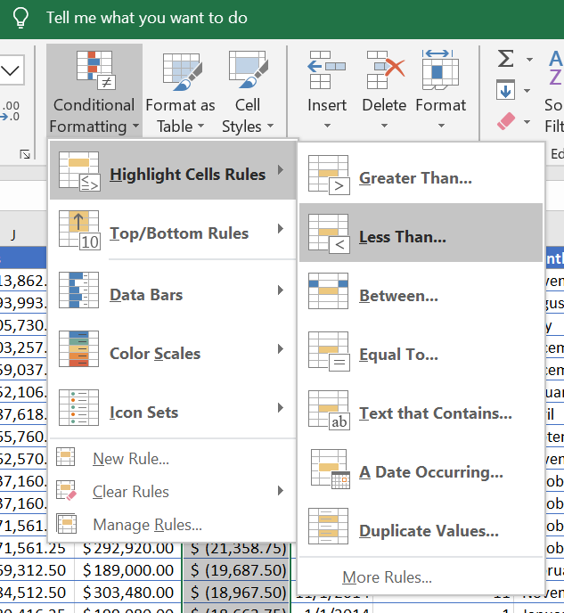
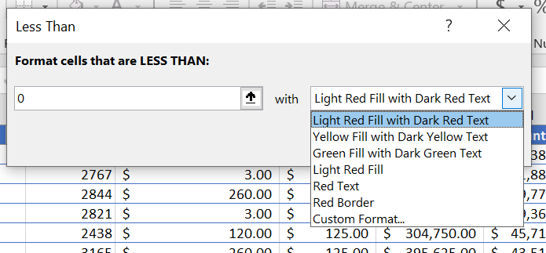
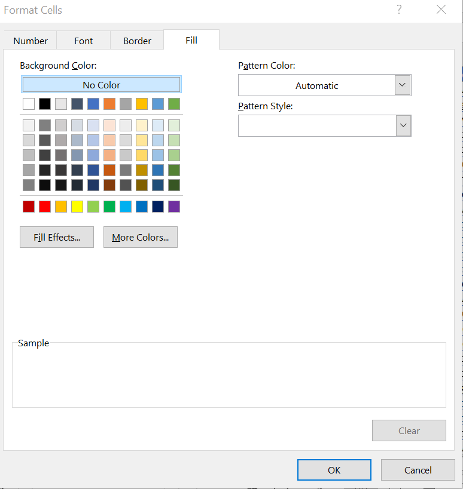
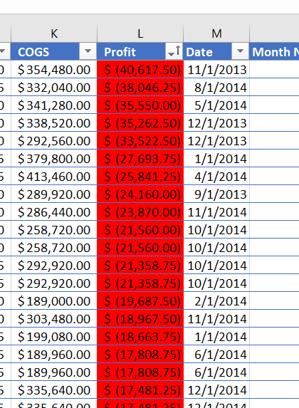
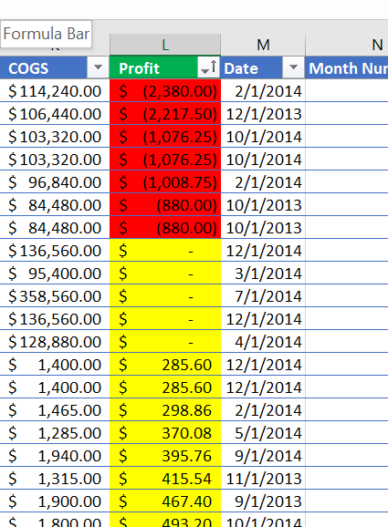
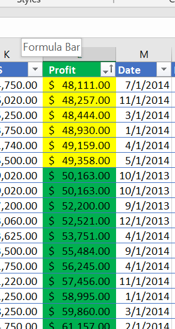

Conditional Formatting
======================

Conditional formatting allows users to highlight their spreadsheet based on criteria. For example,
highlight a cell red if its value is less than zero. Or, highlight a row if a value in one cell in 
that row contains a specific value. Multiple conditions can be placed on one cell. The cell can be
highlighted red if the value is less than zero. If the cell is in between 0 and 50, it will be 
highlighted yellow. Or, if it is greater than 50, it will be highlighted green. 

Using the same financial sheet, conditional formatting will be placed on certain columns to
illustrate its capabilities. First, highlight the ``Profit`` column by clicking on the letter 
``L``. Then, on the ``Home`` ribbon, click on ``Conditional Formatting``, hover the mouse arrow on 
``Highlight Cells Rules`` and click on ``Less than...``. A ``Less Than`` dialog box will popup. 
Enter ``0`` into the left box. Click on the down arrow to the right of ``Light Red Fill with Dark 
Red Text`` to get a drop down.

A preset set list of options will be available or ``Custom Format...`` can be selected. Click on
``Custom Format...`` and a ``Format Cells`` dialog box will popup. Select the second from the left
red color and click ``Ok``. Observe that values less than 0 in that column are already highlighted
red. Click ``Ok`` again to apply the changes. 

Click on ``Conditional Formatting``, hover the mouse arrow on ``Highlight Cells Rules`` and click
on ``Between...``. In the ``Between`` dialog box, enter ``0`` into the left fill-in and ``50000`` 
into the middle fill-in box. Next, click the right drop-down box and click on ``Custom Format``. 
Select the ``Yellow`` color on the ``Format Cells`` and click ``Ok`` in both the ``Format Cells``
and ``Between`` dialog boxes. 

Repeat the same steps above except choose ``Greater Than...``, enter 50000 in the ``Greater Than``
left fill-in box, and the color ``Green``. Scroll down the spreadsheet and observe the colors of
the cells of the ``Profit`` column. 

Experiment with various columns and options for conditional formatting to see how each options
visually changes the spreadsheet.