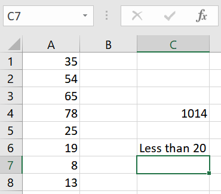

Formulas and Functions Overview
===============================

Formulas
--------

Formulas perform operations on cell(s) and return a value based on those operations.
These operations range from simple arithmetic operations to functions and can be nested.

A formula can be expressed in a cell by the following figure.

Notice how in cell C4, we have typed the formula ``=A3*A4/5``.
Cell C4 is performing an arithmetic operation using cells A3 and A4.
The result of the formula is seen in the figure below.

Functions
---------

Functions are built-in formulas in Excel.

One of the most popular functions in excel is the conditional ``if``.
The ``if`` function is composed of three (3) parts:

   1. logical test
   2. [value if true]
   3. [value if false]

An example can be seen below:

The logical test in the figure above tests if cell A6 is ``A6>20``.
If the logical test is true, ``Greater than 20`` is the value of C6.
If the logical test is false, ``Less than 20`` is the value of cell C6.
Since A6 is less than 20, ``Less than 20`` is the value of cell C6.

Here is another example of the ``if`` function with a text logical test:

The logical test in the figure above tests if the text in cell B2 is equal to ``Hello``.
If the logical test is true, ``Hello`` is the value of C3.
If the logical test is false, ``Bye`` is the value of C3.
Since B2 is equal to Hello, ``Hello`` is the value of C3.

Observe the following example. This example tests B3 if it is equal to ``Hello``.
However, its value if false is not included in the function.

The function still proceeds without errors and returns a value of ``FALSE``.

Here are some things to note in these ``if`` examples.

   1. If any part of the ``if`` function involves strings, they must be enclosed in quotes ``"``.
      This applies to all functions and formulas that use strings.
   2. Conversely, quotes are not required when referencing cells or numbers.
   3. Excel does not require all three parts of the ``if`` function to be defined. The example 
      above only defines a parts 1 and 2 of the ``if`` function. When typing out functions, Excel
      will tell the user which arguments are optional by surrounding that argument with 
      ``[`` ``]``.

Excel at its core is a collection of data and the formulas that manipulate them to create more data.

Formulas all start with an ``=``

Functions have their own word associated with them. If these words are typed in a formula, Excel will
show a list of built in functions it offers. Functions also have arguments. Some arguments are required
for the function to work and some are optional. It can be thought of just like plug and play, where the
arguments are given values and Excel evaluates the formula/function based on those values. This was a 
brief overview of formulas and functions. 

