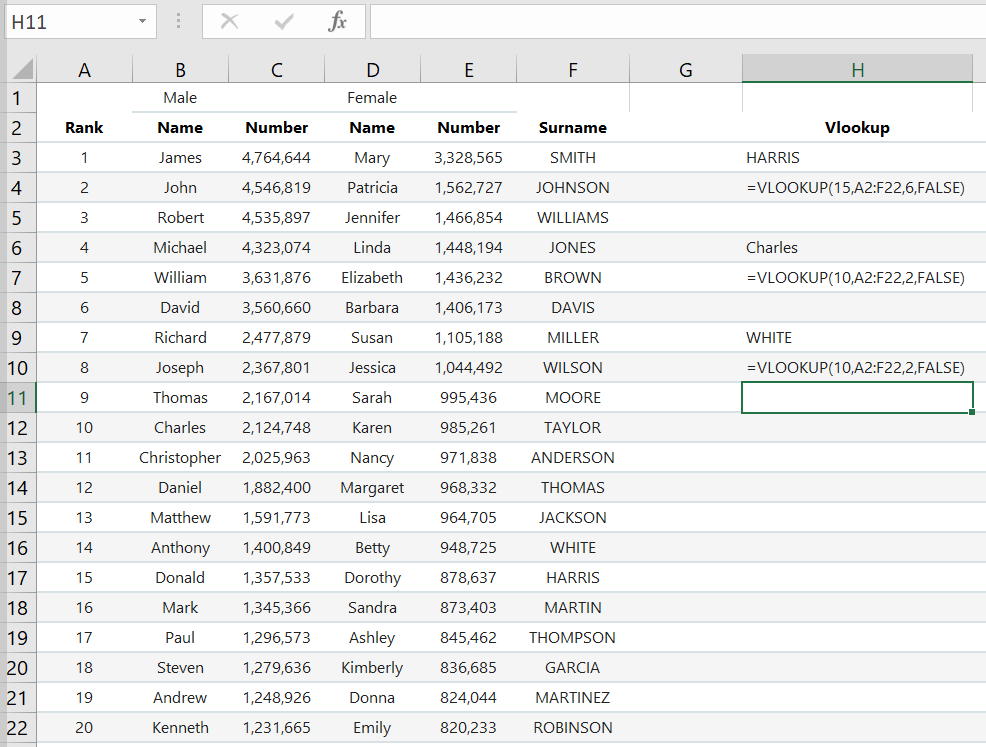

Functions
=========

Basic functions
---------------

In the figure above, there are five basic functions:

    1.  ``Sum``
    2.  ``Average``
    3.  ``Count``
    4.  ``Max``
    5.  ``Min``

Sum
^^^

The ``sum`` function adds a selection cells and takes on the following form:

    ``=sum(number1,number2,number3,...)``

There are three ways to go about using sum. 

The first way is to manually type ``=sum(A1,A2,A3,A4,A5,A6,A7,A8)`` in a blank cell.

.. figure:: _static/images/functions/sum/ex4.png
   :scale: 50%

Excel automatically shows the function's parameters underneath the ``=sum(`` to aid the user in finishing
the formula. This helpful dialog box appears every time a function is in use. The results of the sum of
the numbers are shown below.

.. figure:: _static/images/functions/sum/ex5.png
   :scale: 50%

The second way is to use the shortcut ``Alt+=``. 

.. image:: _static/images/functions/sum/ex6.png
   :scale: 50%
.. image:: _static/images/functions/sum/ex8.png
   :scale: 50%

When using the ``Alt+=`` shortcut in the cells of the figures above, note that Excel automatically
recommends the range of cells to add for the user. Observe one of major differences between method one and two.
In the first method, we manually typed in each cell we wanted to calculate. In the second method,
Excel uses a ``:`` to select the start of the sum range to the end of the sum range. The rest of this book
will use a ``:`` when selecting a range of contiguous cells in a formula. 
The two figures below demonstrate using the 
``Alt+=`` shortcut horizontally. 

.. image:: _static/images/functions/sum/ex9.png
   :scale: 50%

The third way is to click on the sigma button in the Editing section of the Home ribbon. Please note that
doing this produces the same results as the second method above.

.. figure:: _static/images/functions/sum/ex11.png
   :scale: 50%

Average
^^^^^^^

The ``average`` function adds a selection of cells and then divides that sum by the number of cells it added.
Below is the form of the average function. Notice that its form is the same as the ``sum`` function. 

``=average(number1,number2,number3,...)``

The ``average`` function does not have a shortcut. Thus, only methods 1 and 3 for ``sum`` function will work for the 
``average`` function. Start by selecting the cell that will hold the average calculation and type 
``=average(``. Once that has been typed, select the cells that will be included in the calculation. To 
select cells that are not adjacent to one another, press the ``Ctrl`` button and click on the cells to be 
included in the calculation. 

.. image:: _static/images/functions/average/ex1.png
   :scale: 50%
.. image:: _static/images/functions/average/ex2.png
   :scale: 50%

Using method three, select the cell that will hold the average calculation. Click on the down arrow to 
the right of the sigma button and select ``Average``. Just like the ``sum`` function, Excel will recommend
a range of cells to average. It should be noted that even though 9 cells are selected, it will only take 
the average of the 8 cells which contain numbers. It will not calculate the 9th cell.

.. image:: _static/images/functions/average/ex5.png
   :scale: 50%

Count
^^^^^

The ``count`` function evaluates a selection of cells and counts how many of those cells contain numeric values.
``count``, ``max``, and ``min`` have forms just like the functions ``sum`` and ``average``.

``=count(value1,value2,...)``

Using methods 1 and 3 above produces the following results:

.. image:: _static/images/functions/count/ex2.png
   :scale: 50%
.. image:: _static/images/functions/count/ex4.png
   :scale: 50%

.. image:: _static/images/functions/count/ex1.png
   :scale: 50%
.. image:: _static/images/functions/count/ex3.png
   :scale: 50%

Max
^^^

The ``max`` function evaluates a selection of cells and returns the maximum numerical value of those cells.

``=max(number1,number2,...)``

.. image:: _static/images/functions/max/ex4.png
   :scale: 50%

Min
^^^

The ``min`` function evaluates a selection of cells and returns the minimum numerical value of those cells.

``=min(number1,number2,...)``

.. image:: _static/images/functions/min/ex1.png
   :scale: 50%
.. image:: _static/images/functions/min/ex2.png
   :scale: 50%

.. image:: _static/images/functions/min/ex3.png
   :scale: 50%

Concatenate
-----------

``concatenate`` joins data from various cells. There are two ways to concatenate data. 

    1. ``concatenate`` - takes the form of ``=concatenate(text1,text2,text3)``
    2. ``&``

The figure below shows the joining of male first names, column ``B``, with a space and surnames, column 
``F``. Observe that column ``G`` (method 1) and column ``H`` (method 2) both produce the same result in 
column ``I``. 

Left, Mid, Right
----------------

The ``left``, ``mid``, and ``right`` functions extract information from text or a cell. ``left`` starts
at the left most character and returns the specified number of characters to the right. ``right`` does 
the opposite. ``right`` starts at the right most character and returns the specified number of characters
to the left. ``mid`` is slightly different. it takes on three parameters: text, start_num, and num_chars. 
After specifying the text to be extracted, a starting character position in the text or cell is chosen, 
and then the specified number of characters to the right of that starting position is returned.

    1. ``left`` takes on the form ``=left(text,num_chars)``
    2. ``mid`` takes on the form ``=mid(text,start_num,num_chars)``
    3. ``right`` takes on the form ``=right(text,num_chars)``

The ``text`` in each of the functions above can be a string like ``superior`` or it can be a cell like 
in the figure below. The ``left`` function returns the 4 left most characters. The ``right`` function
returns the 3 right most characters. The ``mid`` function starts at the 6th character in the string and
returns the 3 characters to the right of the 6th character. These functions are great for parsing 
information from cells that have uniform values. 

Hlookup
-------

``hlookup`` (horizontal lookup) is a function that retrieves data from a specific row in a table. 
The function has the following form:

``=hlookup(value,table,row_index,[range_lookup])``

In the example below, the value is ``Surname``, the table is starts from ``A2`` and spans to ``F22``.
The row_index is ``15`` and the range_lookup is ``False``. ``hlookup`` needs the 2nd row to search for
the value ``Surname``. Once it finds that value, it will count down ``15`` rows from the second row and
grab the value at that row. Observe that the ``Surname`` of the row 15 is actually the 14th ranked 
surname and not the 15th ranked surname which is ``Harris``. If the 15th ranked surname was desired, 
then the row_index should be 16 and not 15. 

Vlookup
-------

``vlookup`` (vertical lookup) is like ``hlookup`` except that it retrieves the data from a specific
column. Its form is the same as ``hlookup`` and is listed below:

``=vlookup(value,table,row_index,[range_lookup])``

In the example below, row H9 and H10 is the ``vlookup`` method to obtaining the same result as the 
``hlookup`` example that was just shown above. Just like row ``2`` was the first row in ``hlookup``, 
the first column for ``vlookup`` is column ``A``.  In cell H3 and H4, ``vlookup`` returns for the
15th ranked surname. While in cells H6 and H7, ``vlookup`` returns the 10th ranked male name.

