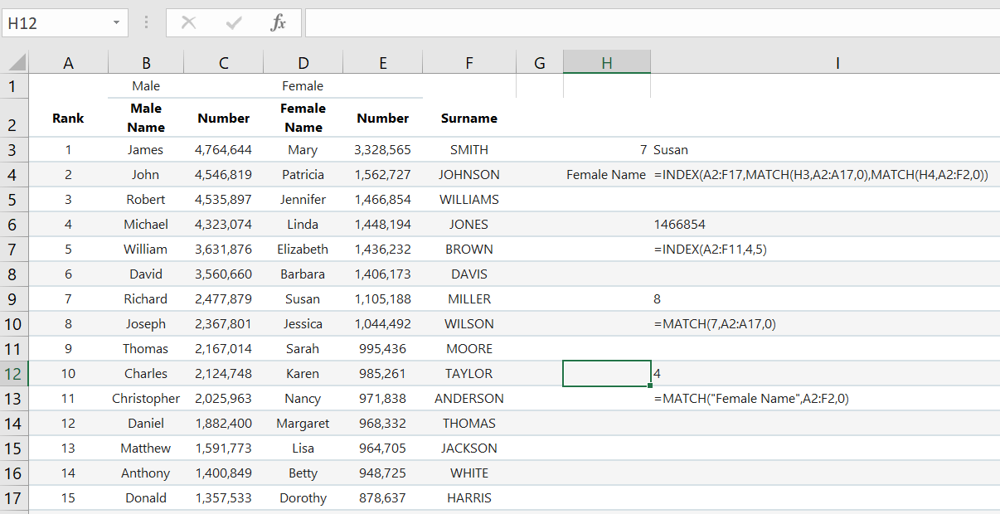

Nested Formulas
===============

Index and Match
---------------

``index`` and ``match`` are two separate functions that when used together in a nested formula, 
can be a very powerful tool like ``vlookup`` and ``hlookup``. These functions are as follows:

``=index(array,row_num,col_num)``

``=match(lookup_value,lookup_array,match_type)``

The ``index`` function looks at a group of cells and goes to the specified row and column and 
returns the value of that cell. The ``match`` function searches for a value in a row or column 
of cells and returns the position of that value. 

Cells ``I6`` and ``I7`` demonstrates the use of ``index``. The group of cells spans from ``A2`` to 
``F11``. The row and column specified are ``4`` and ``5``, respectively. Four rows and five columns
from A2 is cell ``E6`` which has the value ``1466854``.

The first example for match, cell ``I10`` searches for the number ``7`` in the column that spans 
``A2`` to ``A17``. ``7`` is in the 8th position of the array ``A2:A17`` and is the value returned 
in cell ``I9``. The second example, cell ``I13``, searches for the string ``Female Name`` in the
array ``A2:F2`` and returns ``4`` as the position in ``I12``.

Cell ``I2`` has the formula:

``=index(A2:F17,match(H3,A2:A17,0),match(H4,A2:F2,0))``

Observe that inside the ``index`` function, there are two ``match`` functions. These two match
functions are used as the ``row_num`` and ``col_num`` parameters. They are also the same match
functions that were used in cells ``I10`` and ``I13``. When one or more functions are inside 
another function, this is called nesting. Nesting formulas in excel is an advanced technique
allowing for complex operations of cells to determine an output.

Len, And, Or
------------

In this example, the ``if``, ``and``, ``or``, ``len``, and ``concatenate`` functions will be used to
demonstrate a nested formula. 

The ``and`` and ``or`` functions are logical functions that test two or more conditions simultaneously 
and returns a value of either ``TRUE`` or ``FALSE``. The ``len`` evaluates the number of characters in 
a string or cell and returns that count as a number. Their forms are below:

``=and(logical1,logical2,...)``

``=or(logical1,logical2,...)``

``=len(value)``

The first nested formula in cell ``O3`` is:

Analyzing this formula shows the outer most function is the ``if``. Inside the ``if`` function, the 
``len`` function is used in the logical_test parameter to compare the number of letters in the male
name of row 3 to the female of row 3. The ``value_if_true`` parameter of the ``if`` function is 
another ``if`` function. 

This second ``if`` function tests to see if the number of population of male names minus the 
population of surnames is greater than the population of female names minus the population of 
surnames. Its ``value_if_true`` parameter concatenates the male name with the surname. If false,
the female name is concatenated with the surname.

The third ``if`` function is the first ``if`` function's ``value_if_false`` parameter. This ``if``
function compares length of the male and female names. If the male name has more characters,
than the female name, the male name is joined with the surname. If false, it joins the female name
with the surname. 

It should be noted that nested formulas can get long, complicated and confusing very fast. Could the
formula in the previous example been written in a shorter way without the two ``if`` functions nested
and the same concatenation functions being repeated? As users gain more experience and learn more 
functions in Excel, they will start to observe that the repetitive functions inside nested functions 
can be simplified using ``and`` and ``or`` functions. Sometimes, it may be necessary to build the 
formula like the previous example so that the formula below can be realized. 

Notice the nested if statements have been removed. The formula above will concatenate the male name 
with the surname if the length of the male name is greater than the female name or if those lengths
are equal and the difference in population of the male name and surname is greater than the population
difference of the female name and surname.

