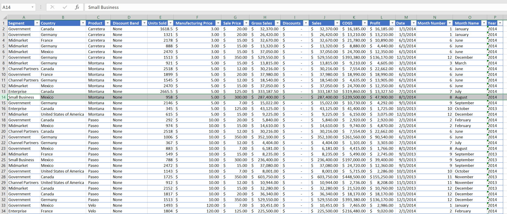
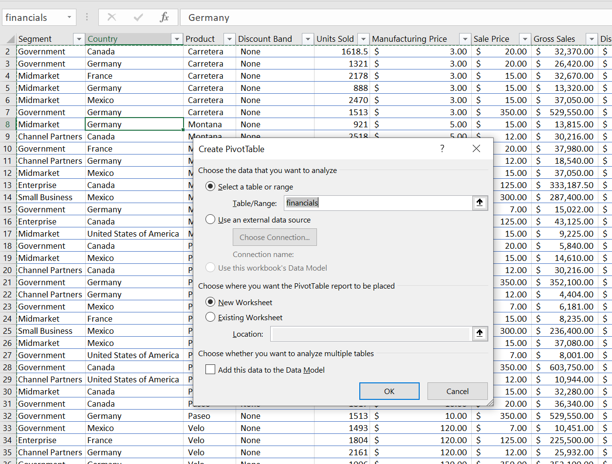
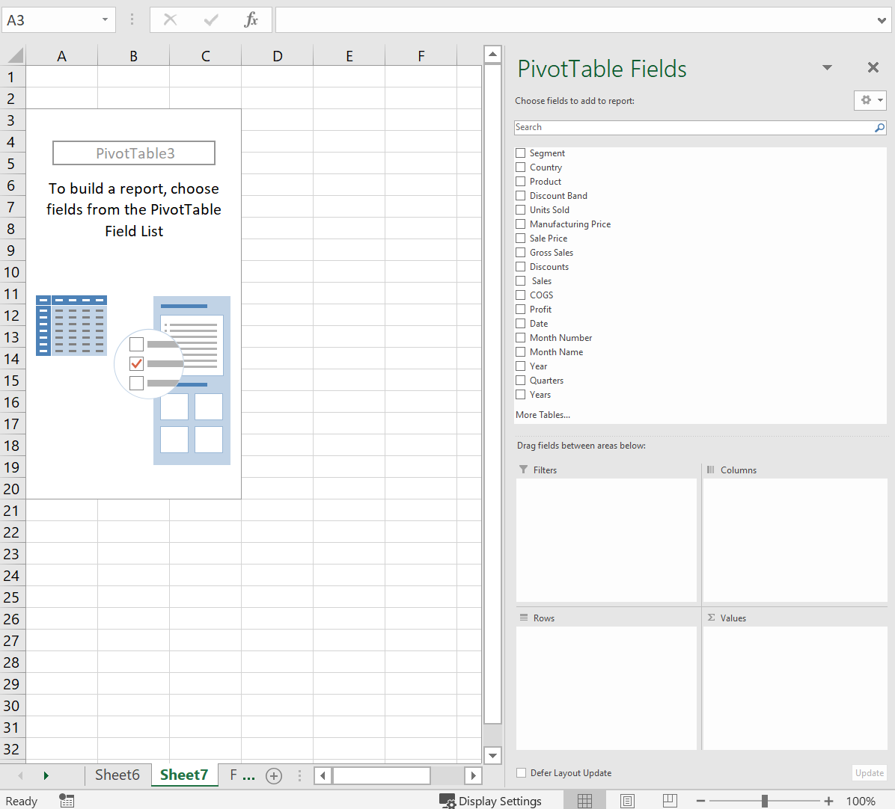
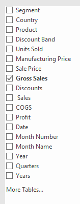
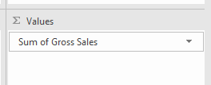
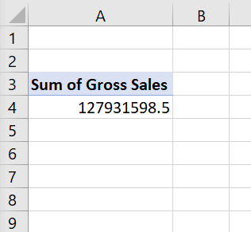
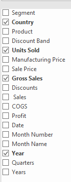
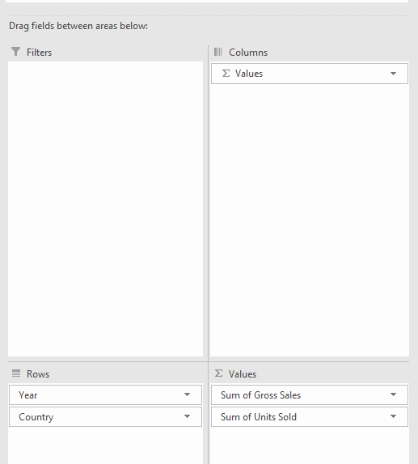
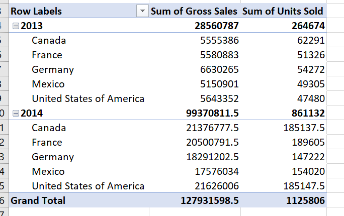

Pivot Tables
============

Pivot tables allow users to summarize data. They are generally used on large sets of data. An advantage 
of using a pivot table is that users do not have to deal with formulas or functions to create it. The
figure below is a large data set will be used to create the pivot table. 

Start by selecting any cell in the data set and then pressing ``Alt``, ``n``, and ``v``. A 
``Create PivotTable`` dialogue box will pop up. 

Observe the ``Table/Range:`` is automatically filled in with the financials and selects all the data in
that worksheet. In the ``Choose where you want the PivotTable report to be placed`` portion of the
dialogue box, a location in the current worksheet can be chosen or a new worksheet can be chosen. For
this example, ``New Worksheet`` will be picked. Click on ``Ok`` and the wizard for the PivotTable will
be created.

On the right side, the fields can be selected by checking them. Start by checking ``Gross Sales``. 
Observe that Excel automatically places it in the Sum Values box and then creates a small 2 rows by 1
column table in the worksheet.

Next, check ``Country``, ``Units Sold``, and ``Year``. Observe where Excel places these selections and
how the table transforms as they are checked. 

Play around with the fields and moving the fields to the ``Filters``, ``Columns``, ``Rows``, and 
``Sum Values`` areas to see how the pivot table adjusts. A pivot table is a powerful tool that allows
users to quickly create meaningful summaries of large data sets.