Codey Rocky Code Blocks
=======================

Emotion
-------

.. |00-look-up| image:: _static/images/codey/00-emotion/00-look-up.png

.. |02-look-left| image:: _static/images/codey/00-emotion/02-look-left.png

.. |04-look-around| image:: _static/images/codey/00-emotion/04-look-around.png

.. |06-smile| image:: _static/images/codey/00-emotion/06-smile.png

.. |08-naughty| image:: _static/images/codey/00-emotion/08-naughty.png
.. |09-proud| image:: _static/images/codey/00-emotion/09-proud.png
.. |10-yummy| image:: _static/images/codey/00-emotion/10-yummy.png

.. |12-wow| image:: _static/images/codey/00-emotion/12-wow.png
.. |13-hurt| image:: _static/images/codey/00-emotion/13-hurt.png
.. |14-sad| image:: _static/images/codey/00-emotion/14-sad.png

.. |16-hello| image:: _static/images/codey/00-emotion/16-hello.png
.. |17-sprint| image:: _static/images/codey/00-emotion/17-sprint.png
.. |18-scared| image:: _static/images/codey/00-emotion/18-scared.png
.. |19-shiver| image:: _static/images/codey/00-emotion/19-shiver.png

.. |21-yawn| image:: _static/images/codey/00-emotion/21-yawn.png
.. |22-sleep| image:: _static/images/codey/00-emotion/22-sleep.png
.. |23-wake| image:: _static/images/codey/00-emotion/23-wake.png
.. |24-yes| image:: _static/images/codey/00-emotion/24-yes.png
.. |25-no| image:: _static/images/codey/00-emotion/25-no.png

.. csv-table:: Emotion
   :header: Block, Effect

   |00-look-up|, look up
   |01-look-down|, look down
   |02-look-left|, look left
   |03-look-right|, look right
   |04-look-around|, look around
   |05-blink|, blink
   |06-smile|, smile
   |07-yeah|, yeah
   |08-naughty|, naughty
   |09-proud|, proud
   |10-yummy|, yummy
   |11-uh-oh|, uh-oh
   |12-wow|, wow
   |13-hurt|, hurt
   |14-sad|, sad
   |15-angry|, angry
   |16-hello|, hello
   |17-sprint|, sprint
   |18-scared|, scared
   |19-shiver|, shiver
   |20-dizzy|, dizzy
   |21-yawn|, yawn
   |22-sleep|, sleep
   |23-wake|, wake
   |24-yes|, yes
   |25-no|, no

Looks
-----

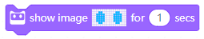
.. |01-show-image| image:: _static/images/codey/01-looks/01-show-image.png
.. |02-show-image-at-x-y| image:: _static/images/codey/01-looks/02-show-image-at-x-y.png
.. |03-turn-off-screen| image:: _static/images/codey/01-looks/03-turn-off-screen.png
.. |04-show-text| image:: _static/images/codey/01-looks/04-show-text.png
.. |05-show-text-until-scroll-done| image:: _static/images/codey/01-looks/05-show-text-until-scroll-done.png
.. |06-show-text-at-x-y| image:: _static/images/codey/01-looks/06-show-text-at-x-y.png
.. |07-light-up-x-y| image:: _static/images/codey/01-looks/07-light-up-x-y.png
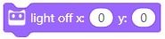
.. |09-switch-light-up-off-x-y| image:: _static/images/codey/01-looks/09-switch-light-up-off-x-y.png

.. csv-table:: Looks
   :header: Block, Effect

   |00-show-image-for-x-secs|, shows ``image`` with duration
   |01-show-image|, shows the specified ``image``
   |02-show-image-at-x-y|, shows ``image`` at coordinate
   |03-turn-off-screen|, turns off the screen 
   |04-show-text|, shows the specified string
   |05-show-text-until-scroll-done|, shows string until scrolling is done 
   |06-show-text-at-x-y|, shows string at coordinate 
   |07-light-up-x-y|, turn on the lights at coordinate
   |08-light-off-x-y|, turn off the lights at coordinate
   |09-switch-light-up-off-x-y|, light ``up`` and ``off`` at coordinate
   |10-x-y-is-lighted-up|, checks if lighted up at coordinate

Lighting
--------

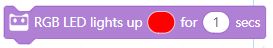
.. |01-rgb-led-lights-up-x| image:: _static/images/codey/02-lighting/01-rgb-led-lights-up-x.png
.. |02-set-indicator-red-green-blue-with-color-value-y| image:: _static/images/codey/02-lighting/02-set-indicator-red-green-blue-with-color-value-y.png
.. |03-rgb-led-lights-off| image:: _static/images/codey/02-lighting/03-rgb-led-lights-off.png
.. |04-set-rocky-light-with-color-rgbycpw| image:: _static/images/codey/02-lighting/04-set-rocky-light-with-color-rgbycpw.png
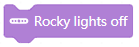

.. csv-table:: Lighting
   :header: Block, Effect

   |00-rgb-led-lights-up-x-for-y-secs|, light up with duration
   |01-rgb-led-lights-up-x|, light up
   |02-set-indicator-red-green-blue-with-color-value-y|, set indicator color
   |03-rgb-led-lights-off|, turn ``LED`` off
   |04-set-rocky-light-with-color-rgbycpw|, set ``Rocky`` light
   |05-rocky-lights-off|, turn off ``Rocky`` light

Speaker
-------

.. |01-play-sound-x-until-done| image:: _static/images/codey/03-speaker/01-play-sound-x-until-done.png
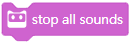
.. |03-play-note-x-for-y-beats| image:: _static/images/codey/03-speaker/03-play-note-x-for-y-beats.png
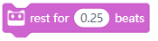
.. |05-play-sound-at-frequency-of-x-hz-secs| image:: _static/images/codey/03-speaker/05-play-sound-at-frequency-of-x-hz-secs.png
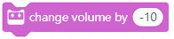
.. |07-set-volume-to-x| image:: _static/images/codey/03-speaker/07-set-volume-to-x.png

.. csv-table:: Speaker
   :header: Block, Effect

   |00-play-sound-x|, plays sound
   |01-play-sound-x-until-done|, plays sound until done
   |02-stop-all-sounds|, stop sounds
   |03-play-note-x-for-y-beats|, plays note
   |04-rest-for-x-beats|, rest
   |05-play-sound-at-frequency-of-x-hz-secs|, play sound at frequency
   |06-change-volume-by-x|, change volume
   |07-set-volume-to-x|, set volume
   |08-volume|, volume value

Action
------

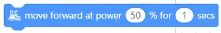
.. |01-move-backward-at-power-x-percent-for-y-secs| image:: _static/images/codey/04-action/01-move-backward-at-power-x-percent-for-y-secs.png
.. |02-turn-left-at-power-x-percent-for-y-secs| image:: _static/images/codey/04-action/02-turn-left-at-power-x-percent-for-y-secs.png
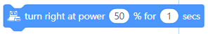
.. |04-keep-straight-forward-at-power-x-percent-for-y-secs| image:: _static/images/codey/04-action/04-keep-straight-forward-at-power-x-percent-for-y-secs.png

.. |07-turn-right-x-degrees-until-done| image:: _static/images/codey/04-action/07-turn-right-x-degrees-until-done.png
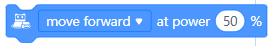
.. |09-left-wheel-turns-at-power-x-percent-right-wheel-at-power-y-percent| image:: _static/images/codey/04-action/09-left-wheel-turns-at-power-x-percent-right-wheel-at-power-y-percent.png
.. |10-stop-moving| image:: _static/images/codey/04-action/10-stop-moving.png

.. csv-table:: Action
   :header: Block, Effect

   |00-move-forward-at-power-x-percent-for-y-secs|, move forward with duration
   |01-move-backward-at-power-x-percent-for-y-secs|, move backward with duration
   |02-turn-left-at-power-x-percent-for-y-secs|, turn left with duration
   |03-turn-right-at-power-x-percent-for-y-secs|, turn right with duration
   |04-keep-straight-forward-at-power-x-percent-for-y-secs|, keep forward with duration
   |05-keep-straight-backward-at-power-x-percent-for-y-secs|, keep backward with duration
   |06-turn-left-x-degrees-until-done|, turn left until done
   |07-turn-right-x-degrees-until-done|, turn right until done
   |08-move-forward-backward-left-right-at-power-x-percent|, move
   |09-left-wheel-turns-at-power-x-percent-right-wheel-at-power-y-percent|, turn left and right wheels
   |10-stop-moving|, stop moving

Sensing
-------

.. |00-button-is-pressed| image:: _static/images/codey/05-sensing/00-button-is-pressed.png
.. |01-when-codey-connected-to-rockey| image:: _static/images/codey/05-sensing/01-when-codey-connected-to-rockey.png

.. |03-loudness| image:: _static/images/codey/05-sensing/03-loudness.png
.. |04-ambient-light-intensity| image:: _static/images/codey/05-sensing/04-ambient-light-intensity.png
.. |05-battery-level| image:: _static/images/codey/05-sensing/05-battery-level.png
.. |06-shaken| image:: _static/images/codey/05-sensing/06-shaken.png

.. |09-codey-positioned-as| image:: _static/images/codey/05-sensing/09-codey-positioned-as.png
.. |10-roll-angle| image:: _static/images/codey/05-sensing/10-roll-angle.png
.. |11-pitch-angle| image:: _static/images/codey/05-sensing/11-pitch-angle.png

.. |13-rotation-angle-around-y| image:: _static/images/codey/05-sensing/13-rotation-angle-around-y.png
.. |14-rotation-angle-around-z| image:: _static/images/codey/05-sensing/14-rotation-angle-around-z.png
.. |15-reset-the-x-rotation-angle| image:: _static/images/codey/05-sensing/15-reset-the-x-rotation-angle.png
.. |16-timer| image:: _static/images/codey/05-sensing/16-timer.png
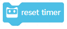
.. |18-obstacles-ahead| image:: _static/images/codey/05-sensing/18-obstacles-ahead.png

.. |20-color-value-detected| image:: _static/images/codey/05-sensing/20-color-value-detected.png
.. |21-color-sensor-ambient-light-intensity| image:: _static/images/codey/05-sensing/21-color-sensor-ambient-light-intensity.png
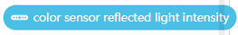
.. |23-color-sensor-refected-infrared-light-intensity| image:: _static/images/codey/05-sensing/23-color-sensor-refected-infrared-light-intensity.png
.. |24-color-sensor-grey-scale-value| image:: _static/images/codey/05-sensing/24-color-sensor-grey-scale-value.png

.. csv-table:: Sensing
   :header: Block, Effect

   |00-button-is-pressed|, checks if button pressed
   |01-when-codey-connected-to-rockey|, ``Codey`` is connected to ``Rockey``
   |02-gear-potentiometer-value|, potentiometer value
   |03-loudness|, loudness
   |04-ambient-light-intensity|, ambient light intensity
   |05-battery-level|, battery level
   |06-shaken|, check if shaken
   |07-shaking-strength|, shaken strength
   |08-codey-tilted|, check if tilted
   |09-codey-positioned-as|, check position
   |10-roll-angle|, roll angle
   |11-pitch-angle|, pitch angle
   |12-rotation-angle-around-x|, ``x`` rotation angle
   |13-rotation-angle-around-y|, ``y`` rotation angle
   |14-rotation-angle-around-z|, ``z`` rotation angle
   |15-reset-the-x-rotation-angle|, reset rotation
   |16-timer|, timer
   |17-reset-timer|, reset timer
   |18-obstacles-ahead|, are there obstacles?
   |19-the-color-detected-is|, color detection
   |20-color-value-detected|, color detection
   |21-color-sensor-ambient-light-intensity|, light detection
   |22-color-sensor-relected-light-intensity|, light detection
   |23-color-sensor-refected-infrared-light-intensity|, infrared detection
   |24-color-sensor-grey-scale-value|, grey-scale value

Infrared
--------

.. |00-send-ir-message-x| image:: _static/images/codey/06-infrared/00-send-ir-message-x.png

.. |02-record-home-appliances-remote-signal-3-secs| image:: _static/images/codey/06-infrared/02-record-home-appliances-remote-signal-3-secs.png
.. |03-send-home-appliances-remote-signal| image:: _static/images/codey/06-infrared/03-send-home-appliances-remote-signal.png

.. csv-table:: Infrared
   :header: Block, Effect

   |00-send-ir-message-x|, sends ``IR`` message
   |01-ir-message-received|, ``IR`` message
   |02-record-home-appliances-remote-signal-3-secs|, record signal
   |03-send-home-appliances-remote-signal|, send signal

Events
------

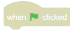
.. |01-when-key-pressed| image:: _static/images/codey/07-events/01-when-key-pressed.png
.. |02-when-codey-starts-up| image:: _static/images/codey/07-events/02-when-codey-starts-up.png
.. |03-when-button-is-pressed| image:: _static/images/codey/07-events/03-when-button-is-pressed.png
.. |04-when-codey-is-shaking| image:: _static/images/codey/07-events/04-when-codey-is-shaking.png
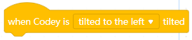
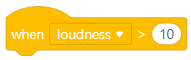
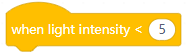
.. |08-when-i-receive-message| image:: _static/images/codey/07-events/08-when-i-receive-message.png

.. |10-broadcast-message-and-wait| image:: _static/images/codey/07-events/10-broadcast-message-and-wait.png

.. csv-table:: Events
   :header: Block, Effect

   |00-when-flag-clicked|, flag is clicked
   |01-when-key-pressed|, key is pressed
   |02-when-codey-starts-up|, ``Codey`` is starting up
   |03-when-button-is-pressed|, button is pressed
   |04-when-codey-is-shaking|, ``Codey`` is shaking
   |05-when-codey-is-tilted|, ``Codey`` is tilted
   |06-when-loudness-or-timer-gt-x|, loudness event
   |07-when-light-intensity-lt-x|, light event
   |08-when-i-receive-message|, message event
   |09-broadcast-message|, send message
   |10-broadcast-message-and-wait|, send message and wait

