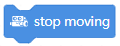

mBot Code Blocks
================

Show
----

.. |00-led-panel-shows-image-for-secs| image:: _static/images/mbot/00-show/00-led-panel-shows-image-for-secs.png
.. |01-led-panel-shows-image| image:: _static/images/mbot/00-show/01-led-panel-shows-image.png
.. |02-led-panel-shows-image-at-x-y| image:: _static/images/mbot/00-show/02-led-panel-shows-image-at-x-y.png

.. |04-led-panel-shows-text-at-x-y| image:: _static/images/mbot/00-show/04-led-panel-shows-text-at-x-y.png

.. |06-led-panel-shows-time| image:: _static/images/mbot/00-show/06-led-panel-shows-time.png
.. |07-led-panel-x-clears-screen| image:: _static/images/mbot/00-show/07-led-panel-x-clears-screen.png

.. csv-table:: Show
   :header: Block, Effect

   |00-led-panel-shows-image-for-secs|,
   |01-led-panel-shows-image|,
   |02-led-panel-shows-image-at-x-y|,
   |03-led-panel-shows-text|,
   |04-led-panel-shows-text-at-x-y|,
   |05-led-panel-shows-number-text|,
   |06-led-panel-shows-time|,
   |07-led-panel-x-clears-screen|,

Light and Sound
---------------

.. |00-led-shows-color-for-secs| image:: _static/images/mbot/01-lightsound/00-led-shows-color-for-secs.png
.. |01-led-shows-color| image:: _static/images/mbot/01-lightsound/01-led-shows-color.png

.. |03-play-note-for-x-beats| image:: _static/images/mbot/01-lightsound/03-play-note-for-x-beats.png

.. csv-table:: Light and Sound
   :header: Block, Effect

   |00-led-shows-color-for-secs|,
   |01-led-shows-color|,
   |02-turn-on-light-with-color-red-green-blue|,
   |03-play-note-for-x-beats|,
   |04-play-sound-at-frequency-of-hz-for-secs|,

Action
------

.. |00-move-forward-at-power-x-for-secs| image:: _static/images/mbot/02-action/00-move-forward-at-power-x-for-secs.png
.. |01-move-backward-at-power-x-for-secs| image:: _static/images/mbot/02-action/01-move-backward-at-power-x-for-secs.png
.. |02-turn-left-at-power-x-for-secs| image:: _static/images/mbot/02-action/02-turn-left-at-power-x-for-secs.png
.. |03-turn-right-at-power-x-for-secs| image:: _static/images/mbot/02-action/03-turn-right-at-power-x-for-secs.png
.. |04-x-at-power-y| image:: _static/images/mbot/02-action/04-x-at-power-y.png
.. |05-left-wheel-turns-at-power-x-right-wheel-at-power-y| image:: _static/images/mbot/02-action/05-left-wheel-turns-at-power-x-right-wheel-at-power-y.png

.. csv-table:: Action
   :header: Block, Effect

   |00-move-forward-at-power-x-for-secs|,
   |01-move-backward-at-power-x-for-secs|,
   |02-turn-left-at-power-x-for-secs|,
   |03-turn-right-at-power-x-for-secs|,
   |04-x-at-power-y|,
   |05-left-wheel-turns-at-power-x-right-wheel-at-power-y|,
   |06-stop-moving|,

Sensing
-------

.. |00-light-sensor-light-intensity| image:: _static/images/mbot/03-sensing/00-light-sensor-light-intensity.png
.. |01-ultrasonic-sensor-distance| image:: _static/images/mbot/03-sensing/01-ultrasonic-sensor-distance.png
.. |02-line-follwer-sensor-value| image:: _static/images/mbot/03-sensing/02-line-follwer-sensor-value.png
.. |03-line-follower-sensor-detects-being| image:: _static/images/mbot/03-sensing/03-line-follower-sensor-detects-being.png

.. |05-ir-remote-pressed| image:: _static/images/mbot/03-sensing/05-ir-remote-pressed.png
.. |06-send-ir-message-text| image:: _static/images/mbot/03-sensing/06-send-ir-message-text.png
.. |07-ir-message-received| image:: _static/images/mbot/03-sensing/07-ir-message-received.png

.. |09-reset-timer| image:: _static/images/mbot/03-sensing/09-reset-timer.png

.. csv-table:: Sensing
   :header: Block, Effect

   |00-light-sensor-light-intensity|,
   |01-ultrasonic-sensor-distance|,
   |02-line-follwer-sensor-value|,
   |03-line-follower-sensor-detects-being|,
   |04-when-on-board-button|,
   |05-ir-remote-pressed|,
   |06-send-ir-message-text|,
   |07-ir-message-received|,
   |08-timer|,
   |09-reset-timer|,

Events
------

.. |00-when-flag-clicked| image:: _static/images/mbot/04-events/00-when-flag-clicked.png
.. |01-when-key-pressed| image:: _static/images/mbot/04-events/01-when-key-pressed.png

.. |03-when-onboard-button-x| image:: _static/images/mbot/04-events/03-when-onboard-button-x.png

.. csv-table:: Events
   :header: Block, Effect

   |00-when-flag-clicked|,
   |01-when-key-pressed|,
   |02-when-mbot-starts-up|,
   |03-when-onboard-button-x|,
   |04-when-receive-message|,
   |05-broadcast-message|,
   |06-broadcast-message-and-wait|,