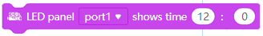
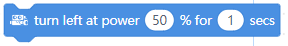
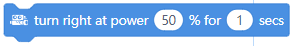

mBot Code Blocks
================

Show
----

The ``Show`` code blocks control the ``LED panel`` if you have it installed. Typically, the LED panel is installed on ``port 1``.

.. |00-led-panel-shows-image-for-secs| image:: _static/images/mbot/00-show/00-led-panel-shows-image-for-secs.png
.. |01-led-panel-shows-image| image:: _static/images/mbot/00-show/01-led-panel-shows-image.png
.. |02-led-panel-shows-image-at-x-y| image:: _static/images/mbot/00-show/02-led-panel-shows-image-at-x-y.png
.. |03-led-panel-shows-text| image:: _static/images/mbot/00-show/03-led-panel-shows-text.png
.. |04-led-panel-shows-text-at-x-y| image:: _static/images/mbot/00-show/04-led-panel-shows-text-at-x-y.png
.. |05-led-panel-shows-number-text| image:: _static/images/mbot/00-show/05-led-panel-shows-number-text.png

.. |07-led-panel-x-clears-screen| image:: _static/images/mbot/00-show/07-led-panel-x-clears-screen.png

.. csv-table:: Show
   :header: Block, Effect

   |00-led-panel-shows-image-for-secs|, displays image with duration
   |01-led-panel-shows-image|, displays the specified image
   |02-led-panel-shows-image-at-x-y|, displays image at coordinate
   |03-led-panel-shows-text|, displays the specified string
   |04-led-panel-shows-text-at-x-y|, displays string at coordinate
   |05-led-panel-shows-number-text|, displays the specified number
   |06-led-panel-shows-time|, displays the time
   |07-led-panel-x-clears-screen|, clears the screen

Light and Sound
---------------

.. |00-led-shows-color-for-secs| image:: _static/images/mbot/01-lightsound/00-led-shows-color-for-secs.png

.. |02-turn-on-light-with-color-red-green-blue| image:: _static/images/mbot/01-lightsound/02-turn-on-light-with-color-red-green-blue.png

.. |04-play-sound-at-frequency-of-hz-for-secs| image:: _static/images/mbot/01-lightsound/04-play-sound-at-frequency-of-hz-for-secs.png

.. csv-table:: Light and Sound
   :header: Block, Effect

   |00-led-shows-color-for-secs|, shows ``color`` with duration
   |01-led-shows-color|, shows ``color``
   |02-turn-on-light-with-color-red-green-blue|, "shows color with ``red``, ``green`` and ``blue`` amounts"
   |03-play-note-for-x-beats|, plays ``note`` at ``beat``
   |04-play-sound-at-frequency-of-hz-for-secs|, plays a sound at ``frequency`` with duration

Action
------

.. |00-move-forward-at-power-x-for-secs| image:: _static/images/mbot/02-action/00-move-forward-at-power-x-for-secs.png
.. |01-move-backward-at-power-x-for-secs| image:: _static/images/mbot/02-action/01-move-backward-at-power-x-for-secs.png

.. |04-x-at-power-y| image:: _static/images/mbot/02-action/04-x-at-power-y.png
.. |05-left-wheel-turns-at-power-x-right-wheel-at-power-y| image:: _static/images/mbot/02-action/05-left-wheel-turns-at-power-x-right-wheel-at-power-y.png
.. |06-stop-moving| image:: _static/images/mbot/02-action/06-stop-moving.png

.. csv-table:: Action
   :header: Block, Effect

   |00-move-forward-at-power-x-for-secs|, move ``forward`` with duration
   |01-move-backward-at-power-x-for-secs|, move ``backward`` with duration
   |02-turn-left-at-power-x-for-secs|, turn ``left`` with duration
   |03-turn-right-at-power-x-for-secs|, turn ``right`` with duration
   |04-x-at-power-y|, move
   |05-left-wheel-turns-at-power-x-right-wheel-at-power-y|, turn the ``left`` and ``right`` wheels
   |06-stop-moving|, stop moving

Sensing
-------

.. |01-ultrasonic-sensor-distance| image:: _static/images/mbot/03-sensing/01-ultrasonic-sensor-distance.png

.. |03-line-follower-sensor-detects-being| image:: _static/images/mbot/03-sensing/03-line-follower-sensor-detects-being.png
.. |04-when-on-board-button| image:: _static/images/mbot/03-sensing/04-when-on-board-button.png
.. |05-ir-remote-pressed| image:: _static/images/mbot/03-sensing/05-ir-remote-pressed.png
.. |06-send-ir-message-text| image:: _static/images/mbot/03-sensing/06-send-ir-message-text.png
.. |07-ir-message-received| image:: _static/images/mbot/03-sensing/07-ir-message-received.png
.. |08-timer| image:: _static/images/mbot/03-sensing/08-timer.png
.. |09-reset-timer| image:: _static/images/mbot/03-sensing/09-reset-timer.png

.. csv-table:: Sensing
   :header: Block, Effect

   |00-light-sensor-light-intensity|, toggles ``light intensity`` reading
   |01-ultrasonic-sensor-distance|, toggles ``ultrasonic sensor`` reading
   |02-line-follwer-sensor-value|, toggles ``line sensor`` reading
   |03-line-follower-sensor-detects-being|, line sensor detects color
   |04-when-on-board-button|, onboard button is pressed
   |05-ir-remote-pressed|, button pressed on ``IR`` remote
   |06-send-ir-message-text|, sends and ``IR`` message
   |07-ir-message-received|, the ``IR`` message received
   |08-timer|, toggles ``timer``
   |09-reset-timer|, resets the timer

Events
------

.. |02-when-mbot-starts-up| image:: _static/images/mbot/04-events/02-when-mbot-starts-up.png

.. |04-when-receive-message| image:: _static/images/mbot/04-events/04-when-receive-message.png
.. |05-broadcast-message| image:: _static/images/mbot/04-events/05-broadcast-message.png
.. |06-broadcast-message-and-wait| image:: _static/images/mbot/04-events/06-broadcast-message-and-wait.png

.. csv-table:: Events
   :header: Block, Effect

   |00-when-flag-clicked|, when the ``flag`` is clicked 
   |01-when-key-pressed|, when a ``key`` is pressed 
   |02-when-mbot-starts-up|, when the robot starts up 
   |03-when-onboard-button-x|, when the ``on-board`` button is pressed or released
   |04-when-receive-message|, when a message is received
   |05-broadcast-message|, broadcast a message 
   |06-broadcast-message-and-wait|, broadcast a message and wait 