Codey Rocky Code Blocks
=======================

Emotion
-------

.. |15-angry| image:: _static/images/codey/00-emotion/15-angry.png

.. |22-sleep| image:: _static/images/codey/00-emotion/22-sleep.png

.. |25-no| image:: _static/images/codey/00-emotion/25-no.png

.. csv-table:: Emotion
   :header: Block, Effect

   |00-look-up|,
   |01-look-down|,
   |02-look-left|,
   |03-look-right|,
   |04-look-around|,
   |05-blink|,
   |06-smile|,
   |07-yeah|,
   |08-naughty|,
   |09-proud|,
   |10-yummy|,
   |11-un-oh|,
   |12-wow|,
   |13-hurt|,
   |14-sad|,
   |15-angry|,
   |16-hello|,
   |17-sprint|,
   |18-scared|,
   |19-shiver|,
   |20-dizzy|,
   |21-yawn|,
   |22-sleep|,
   |23-wake|,
   |24-yes|,
   |25-no|,

Looks
-----

.. |00-show-image-for-x-secs| image:: _static/images/codey/01-looks/00-show-image-for-x-secs.png
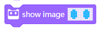
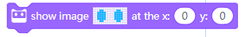
.. |03-turn-off-screen| image:: _static/images/codey/01-looks/03-turn-off-screen.png

.. |06-show-text-at-x-y| image:: _static/images/codey/01-looks/06-show-text-at-x-y.png
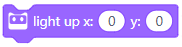
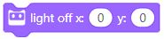
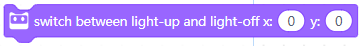

.. csv-table:: Looks
   :header: Block, Effect

   |00-show-image-for-x-secs|,
   |01-show-image|,
   |02-show-image-at-x-y|,
   |03-turn-off-screen|,
   |04-show-text|,
   |05-show-text-until-scroll-done|,
   |06-show-text-at-x-y|,
   |07-light-up-x-y|,
   |08-light-off-x-y|,
   |09-switch-light-up-off-x-y|,
   |10-x-y-is-lighted-up|,

Lighting
--------

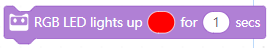

.. |02-set-indicator-red-green-blue-with-color-value-y| image:: _static/images/codey/02-lighting/02-set-indicator-red-green-blue-with-color-value-y.png
.. |03-rgb-led-lights-off| image:: _static/images/codey/02-lighting/03-rgb-led-lights-off.png

.. csv-table:: Lighting
   :header: Block, Effect

   |00-rgb-led-lights-up-x-for-y-secs|,
   |01-rgb-led-lights-up-x|,
   |02-set-indicator-red-green-blue-with-color-value-y|,
   |03-rgb-led-lights-off|,
   |04-set-rocky-light-with-color-rgbycpw|,
   |05-rocky-lights-off|,

Speaker
-------

.. |04-rest-for-x-beats| image:: _static/images/codey/03-speaker/04-rest-for-x-beats.png

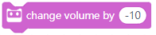

.. csv-table:: Speaker
   :header: Block, Effect

   |00-play-sound-x|,
   |01-play-sound-x-until-done|,
   |02-stop-all-sounds|,
   |03-play-note-x-for-y-beats|,
   |04-rest-for-x-beats|,
   |05-play-sound-at-frequency-of-x-hz-secs|,
   |06-change-volume-by-x|,
   |07-set-volume-to-x|,
   |08-volume|,

Action
------

.. |03-turn-right-at-power-x-percent-for-y-secs| image:: _static/images/codey/04-action/03-turn-right-at-power-x-percent-for-y-secs.png

.. |08-move-forward-backward-left-right-at-power-x-percent| image:: _static/images/codey/04-action/08-move-forward-backward-left-right-at-power-x-percent.png

.. |10-stop-moving| image:: _static/images/codey/04-action/10-stop-moving.png

.. csv-table:: Action
   :header: Block, Effect

   |00-move-forward-at-power-x-percent-for-y-secs|,
   |01-move-backward-at-power-x-percent-for-y-secs|,
   |02-turn-left-at-power-x-percent-for-y-secs|,
   |03-turn-right-at-power-x-percent-for-y-secs|,
   |04-keep-straight-forward-at-power-x-percent-for-y-secs|,
   |05-keep-straight-backward-at-power-x-percent-for-y-secs|,
   |06-turn-left-x-degrees-until-done|,
   |07-turn-right-x-degrees-until-done|,
   |08-move-forward-backward-left-right-at-power-x-percent|,
   |09-left-wheel-turns-at-power-x-percent-right-wheel-at-power-y-percent|,
   |10-stop-moving|,

Sensing
-------

.. |00-button-is-pressed| image:: _static/images/codey/05-sensing/00-button-is-pressed.png

.. |06-shaken| image:: _static/images/codey/05-sensing/06-shaken.png

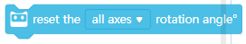

.. csv-table:: Sensing
   :header: Block, Effect

   |00-button-is-pressed|,
   |01-when-codey-connected-to-rockey|,
   |02-gear-potentiometer-value|,
   |03-loudness|,
   |04-ambient-light-intensity|,
   |05-battery-level|,
   |06-shaken|,
   |07-shaking-strength|,
   |08-codey-tilted|,
   |09-codey-positioned-as|,
   |10-roll-angle|,
   |11-pitch-angle|,
   |12-rotation-angle-around-x|,
   |13-rotation-angle-around-y|,
   |14-rotation-angle-around-z|,
   |15-reset-the-x-rotation-angle|,
   |16-timer|,
   |17-reset-timer|,
   |18-obstacles-ahead|,
   |19-the-color-detected-is|,
   |20-color-value-detected|,
   |21-color-sensor-ambient-light-intensity|,
   |22-color-sensor-relected-light-intensity|,
   |23-color-sensor-refected-infrared-light-intensity|,
   |24-color-sensor-grey-scale-value|,

Infrared
--------

.. |00-send-ir-message-x| image:: _static/images/codey/06-infrared/00-send-ir-message-x.png
.. |01-ir-message-received| image:: _static/images/codey/06-infrared/01-ir-message-received.png

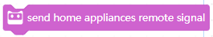

.. csv-table:: Infrared
   :header: Block, Effect

   |00-send-ir-message-x|,
   |01-ir-message-received|,
   |02-record-home-appliances-remote-signal-3-secs|,
   |03-send-home-appliances-remote-signal|,

Events
------

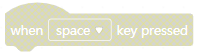

.. |03-when-button-is-pressed| image:: _static/images/codey/07-events/03-when-button-is-pressed.png
.. |04-when-codey-is-shaking| image:: _static/images/codey/07-events/04-when-codey-is-shaking.png

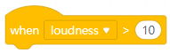
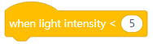
.. |08-when-i-receive-message| image:: _static/images/codey/07-events/08-when-i-receive-message.png
.. |09-broadcast-message| image:: _static/images/codey/07-events/09-broadcast-message.png

.. csv-table:: Events
   :header: Block, Effect

   |00-when-flag-clicked|,
   |01-when-key-pressed|,
   |02-when-codey-starts-up|,
   |03-when-button-is-pressed|,
   |04-when-codey-is-shaking|,
   |05-when-codey-is-tilted|,
   |06-when-loudness-or-timer-gt-x|,
   |07-when-light-intensity-lt-x|,
   |08-when-i-receive-message|,
   |09-broadcast-message|,
   |10-broadcast-message-and-wait|,

Control
-------

.. |00-wait-x-seconds| image:: _static/images/common/00-control/00-wait-x-seconds.png
.. |01-repeat-x| image:: _static/images/common/00-control/01-repeat-x.png
.. |02-forever| image:: _static/images/common/00-control/02-forever.png
.. |03-if-then| image:: _static/images/common/00-control/03-if-then.png
.. |04-if-then-else| image:: _static/images/common/00-control/04-if-then-else.png
.. |05-wait-until| image:: _static/images/common/00-control/05-wait-until.png
.. |06-repeat-until| image:: _static/images/common/00-control/06-repeat-until.png
.. |07-stop| image:: _static/images/common/00-control/07-stop.png

.. csv-table:: Control
   :header: Block, Effect

   |00-wait-x-seconds|,
   |01-repeat-x|,
   |02-forever|,
   |03-if-then|,
   |04-if-then-else|,
   |05-wait-until|,
   |06-repeat-until|,
   |07-stop|,

Operators
---------

.. |00-x-plus-y| image:: _static/images/common/01-operators/00-x-plus-y.png
.. |01-x-minus-y| image:: _static/images/common/01-operators/01-x-minus-y.png
.. |02-x-times-y| image:: _static/images/common/01-operators/02-x-times-y.png
.. |03-x-divide-y| image:: _static/images/common/01-operators/03-x-divide-y.png
.. |04-pick-random-x-to-y| image:: _static/images/common/01-operators/04-pick-random-x-to-y.png
.. |05-x-gt-y| image:: _static/images/common/01-operators/05-x-gt-y.png
.. |06-x-lt-y| image:: _static/images/common/01-operators/06-x-lt-y.png
.. |07-x-equals-y| image:: _static/images/common/01-operators/07-x-equals-y.png
.. |08-x-and-y| image:: _static/images/common/01-operators/08-x-and-y.png
.. |09-x-or-y| image:: _static/images/common/01-operators/09-x-or-y.png
.. |10-not-x| image:: _static/images/common/01-operators/10-not-x.png
.. |11-join-text-text| image:: _static/images/common/01-operators/11-join-text-text.png
.. |12-letter-x-of-text| image:: _static/images/common/01-operators/12-letter-x-of-text.png
.. |13-length-of-text| image:: _static/images/common/01-operators/13-length-of-text.png
.. |14-text-contains-x| image:: _static/images/common/01-operators/14-text-contains-x.png
.. |15-x-mod-y| image:: _static/images/common/01-operators/15-x-mod-y.png
.. |16-| image:: _static/images/common/01-operators/16-.png
.. |17-math-of-x| image:: _static/images/common/01-operators/17-math-of-x.png

.. csv-table:: Operators
   :header: Block, Effect

   |00-x-plus-y|,
   |01-x-minus-y|,
   |02-x-times-y|,
   |03-x-divide-y|,
   |04-pick-random-x-to-y|,
   |05-x-gt-y|,
   |06-x-lt-y|,
   |07-x-equals-y|,
   |08-x-and-y|,
   |09-x-or-y|,
   |10-not-x|,
   |11-join-text-text|,
   |12-letter-x-of-text|,
   |13-length-of-text|,
   |14-text-contains-x|,
   |15-x-mod-y|,
   |16-|,
   |17-math-of-x|,

Variables
---------

.. |00-make-a-variable| image:: _static/images/common/02-variables/00-make-a-variable.png
.. |01-make-a-list| image:: _static/images/common/02-variables/01-make-a-list.png

.. csv-table:: Variables
   :header: Block, Effect

   |00-make-a-variable|,
   |01-make-a-list|,

My-Blocks
---------

.. |00-make-a-block| image:: _static/images/common/03-my-blocks/00-make-a-block.png

.. csv-table:: My-Blocks
   :header: Block, Effect

   |00-make-a-block|,