Codey Rocky Code Blocks
=======================

Lighting
--------

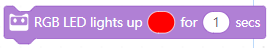

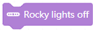
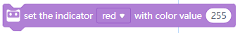
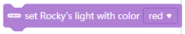

.. csv-table:: Lighting
   :header: Block, Effect

   |rgb-led-lights-off|, 
   |rgb-led-lights-up-x-for-y-secs|, 
   |rgb-led-lights-up-x|, 
   |rocky-lights-off|, 
   |set-indicator-red-green-blue-with-color-value-y|, 
   |set-rocky-light-with-color-rgbycpw|, 

Action
------

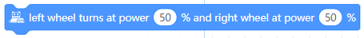
.. |move-backward-at-power-x-percent-for-y-secs| image:: _static/images/codey/action/move-backward-at-power-x-percent-for-y-secs.png
.. |move-forward-at-power-x-percent-for-y-secs| image:: _static/images/codey/action/move-forward-at-power-x-percent-for-y-secs.png

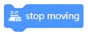
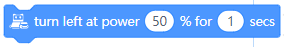

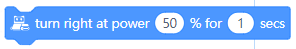

.. csv-table:: Action
   :header: Block, Effect

   |keep-straight-backward-at-power-x-percent-for-y-secs|, 
   |keep-straight-forward-at-power-x-percent-for-y-secs|, 
   |left-wheel-turns-at-power-x-percent-right-wheel-at-power-y-percent|, 
   |move-backward-at-power-x-percent-for-y-secs|, 
   |move-forward-at-power-x-percent-for-y-secs|, 
   |move-forward-backward-left-right-at-power-x-percent|, 
   |stop-moving|, 
   |turn-left-at-power-x-percent-for-y-secs|, 
   |turn-left-x-degrees-until-done|, 
   |turn-right-at-power-x-percent-for-y-secs|, 
   |turn-right-x-degrees-until-done|, 

Looks
-----

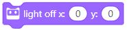
.. |light-up-x-y| image:: _static/images/codey/looks/light-up-x-y.png
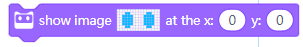
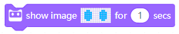
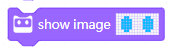
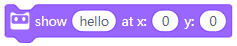
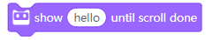

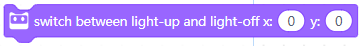
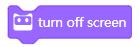
.. |x-y-is-lighted-up| image:: _static/images/codey/looks/x-y-is-lighted-up.png

.. csv-table:: Looks
   :header: Block, Effect

   |light-off-x-y|, 
   |light-up-x-y|, 
   |show-image-at-x-y|, 
   |show-image-for-x-secs|, 
   |show-image|, 
   |show-text-at-x-y|, 
   |show-text-until-scroll-done|, 
   |show-text|, 
   |switch-light-up-off-x-y|, 
   |turn-off-screen|, 
   |x-y-is-lighted-up|, 

Sensing
-------

.. |color-sensor-grey-scale-value| image:: _static/images/codey/sensing/color-sensor-grey-scale-value.png
.. |color-sensor-refected-infrared-light-intensity| image:: _static/images/codey/sensing/color-sensor-refected-infrared-light-intensity.png
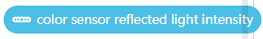
.. |color-value-detected| image:: _static/images/codey/sensing/color-value-detected.png

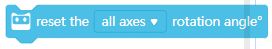
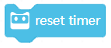

.. |rotation-angle-around-x| image:: _static/images/codey/sensing/rotation-angle-around-x.png

.. |shaking-strength| image:: _static/images/codey/sensing/shaking-strength.png
.. |the-color-detected-is| image:: _static/images/codey/sensing/the-color-detected-is.png

.. csv-table:: Sensing
   :header: Block, Effect

   |ambient-light-intensity|, 
   |battery-level|, 
   |button-is-pressed|, 
   |codey-positioned-as|, 
   |codey-tilted|, 
   |color-sensor-ambient-light-intensity|, 
   |color-sensor-grey-scale-value|, 
   |color-sensor-refected-infrared-light-intensity|, 
   |color-sensor-relected-light-intensity|, 
   |color-value-detected|, 
   |gear-potentiometer-value|, 
   |loudness|, 
   |obstacles-ahead|, 
   |pitch-angle|, 
   |reset-the-x-rotation-angle|, 
   |reset-timer|, 
   |roll-angle|, 
   |rotation-angle-around-x|, 
   |rotation-angle-around-y|, 
   |rotation-angle-around-z|, 
   |shaken|, 
   |shaking-strength|, 
   |the-color-detected-is|, 
   |timer|, 
   |when-codey-connected-to-rockey|, 

Infrared
--------

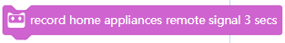
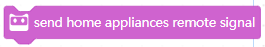

.. csv-table:: Infrared
   :header: Block, Effect

   |ir-message-received|, 
   |record-home-appliances-remote-signal-3-secs|, 
   |send-home-appliances-remote-signal|, 
   |send-ir-message-x|, 

Events
------

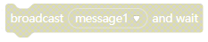

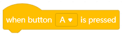

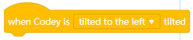

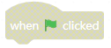
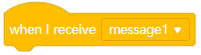
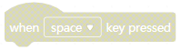
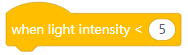
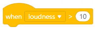

.. csv-table:: Events
   :header: Block, Effect

   |broadcast-message-and-wait|, 
   |broadcast-message|, 
   |when-button-is-pressed|, 
   |when-codey-is-shaking|, 
   |when-codey-is-tilted|, 
   |when-codey-starts-up|, 
   |when-flag-clicked|, 
   |when-i-receive-message|, 
   |when-key-pressed|, 
   |when-light-intensity-lt-x|, 
   |when-loudness-or-timer-gt-x|, 

Emotion
-------

.. |proud| image:: _static/images/codey/emotion/proud.png

.. |shiver| image:: _static/images/codey/emotion/shiver.png

.. |wake| image:: _static/images/codey/emotion/wake.png

.. csv-table:: Emotion
   :header: Block, Effect

   |angry|, 
   |blink|, 
   |dizzy|, 
   |hello|, 
   |hurt|, 
   |look-around|, 
   |look-down|, 
   |look-left|, 
   |look-right|, 
   |look-up|, 
   |naughty|, 
   |no|, 
   |proud|, 
   |sad|, 
   |scared|, 
   |shiver|, 
   |sleep|, 
   |smile|, 
   |sprint|, 
   |un-oh|, 
   |wake|, 
   |wow|, 
   |yawn|, 
   |yeah|, 
   |yes|, 
   |yummy|, 

Speaker
-------

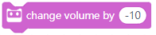
.. |play-note-x-for-y-beats| image:: _static/images/codey/speaker/play-note-x-for-y-beats.png
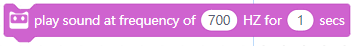
.. |play-sound-x-until-done| image:: _static/images/codey/speaker/play-sound-x-until-done.png
.. |play-sound-x| image:: _static/images/codey/speaker/play-sound-x.png

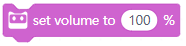
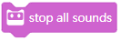

.. csv-table:: Speaker
   :header: Block, Effect

   |change-volume-by-x|, 
   |play-note-x-for-y-beats|, 
   |play-sound-at-frequency-of-x-hz-secs|, 
   |play-sound-x-until-done|, 
   |play-sound-x|, 
   |rest-for-x-beats|, 
   |set-volume-to-x|, 
   |stop-all-sounds|, 
   |volume|,

Control
-------

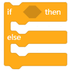
.. |if-then| image:: _static/images/common/control/if-then.png
.. |repeat-until| image:: _static/images/common/control/repeat-until.png
.. |repeat-x| image:: _static/images/common/control/repeat-x.png

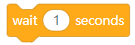

.. csv-table:: Control
   :header: Block, Effect

   |forever|, 
   |if-then-else|, 
   |if-then|, 
   |repeat-until|, 
   |repeat-x|, 
   |stop|, 
   |wait-until|, 
   |wait-x-seconds|, 

Operators
---------

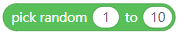

.. csv-table:: Operators
   :header: Block, Effect

   |join-text-text|, 
   |length-of-text|, 
   |letter-x-to-text|, 
   |math-of-x|, 
   |not-x|, 
   |pick-random-x-to-y|, 
   |round-x|, 
   |text-contains-x|, 
   |x-and-y|, 
   |x-divide-y|, 
   |x-equals-y|, 
   |x-gt-y|, 
   |x-lt-y|, 
   |x-minus-y|, 
   |x-mod-y|, 
   |x-or-y|, 
   |x-plus-y|, 
   |x-times-y|,

Variables
---------

.. csv-table:: Variables
   :header: Block, Effect

   |make-a-list|, 
   |make-a-variable|, 

My-Blocks
---------

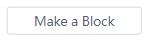

.. csv-table:: My-Blocks
   :header: Block, Effect

   |make-a-block|, 