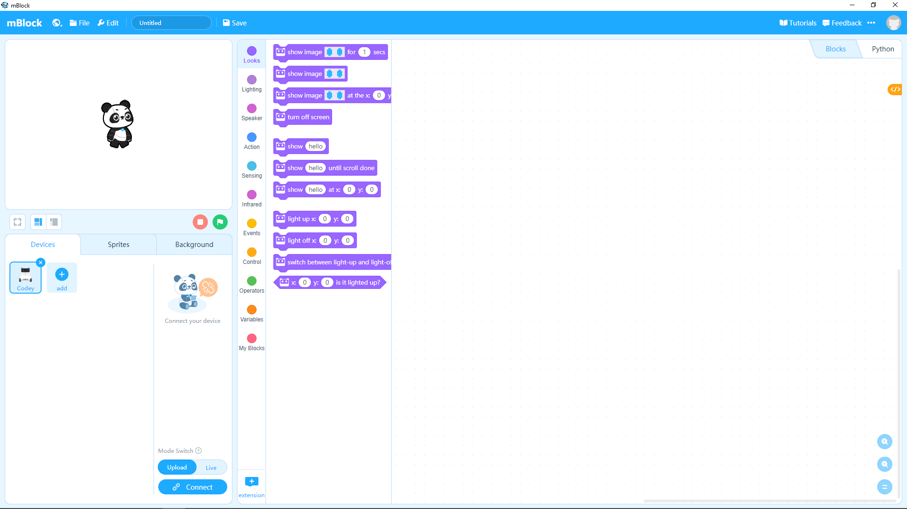
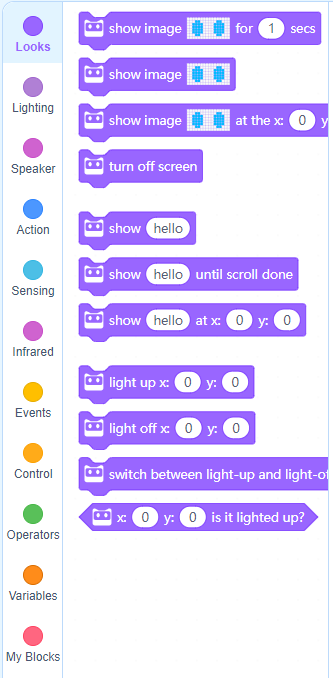
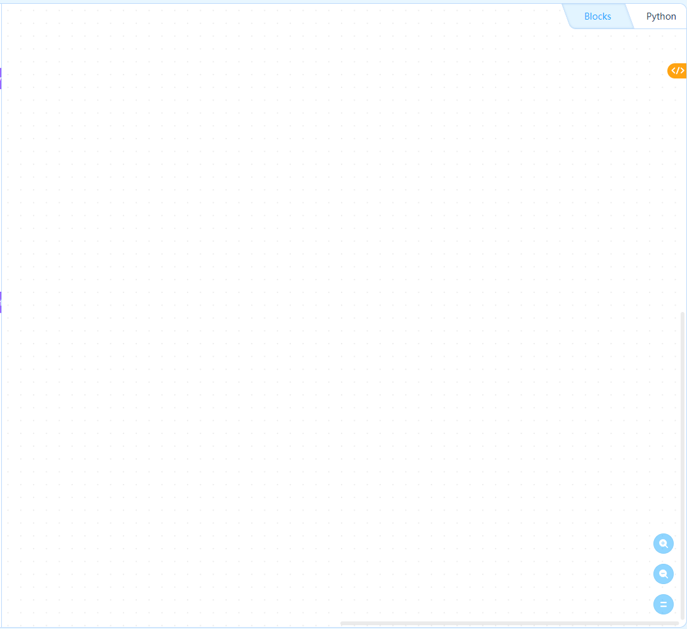
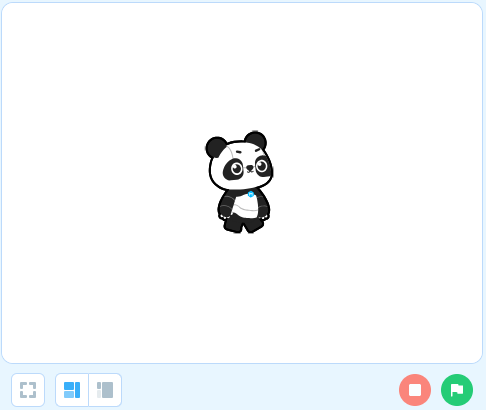
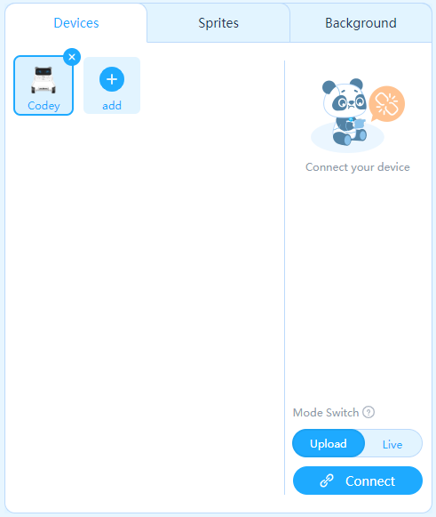
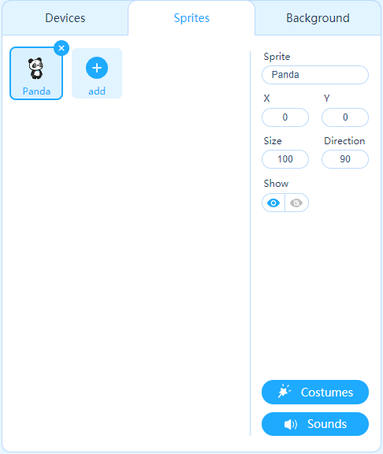
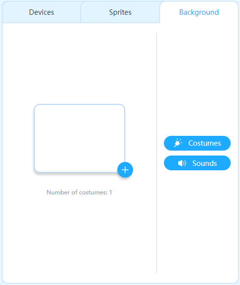

mBlock
======

The ``Makeblock`` Integrated Development Environment (IDE) is based on ``Scratch`` and is a complete, self-contained program used to program and code behavior into Makeblock robots. The Makeblock IDE is called ``mBlock``. When you start mBlock, it should look like the following. 

    
    The Integrated Development Environment (IDE).

Note that there are 7 major components to mBlock.

.. csv-table:: mBlock Components
   :header: " ", Component, Purpose

   1, Menu, Load and save files.
   2, Code Blocks, Reusable code blocks to control and add behavior to your program.
   3, Script Editor, Area to build your code logic.
   4, Stage, Area that shows your program in execution.
   5, Device Control, "Area to add and remove different types of robots."
   6, Sprite Control, "Area to add, update, remove and define your sprites."
   7, Background Control, "Area to add, update, remove and define backgrounds."

We breakdown these major components of mBlock and discuss each below.

Menu
----

.. figure:: _static/images/ide/menu.png
    
    The menu.

Code blocks
-----------

As different devices or robots have different capabilities, the code blocks available will change depending on the currently selected device. The screenshot below shows the available code blocks for the ``Codey`` robot.

    
    The code blocks.

Script editor
-------------

    
    The script editor area. Notice how you may toggle between ``Blocks`` and ``Python``?

Stage
-----

    
    The stage.

Devices
-------

    
    The devices control area.

Sprites
-------

    
    The sprites control area.

Backgrounds
-----------

    
    The background control area.
