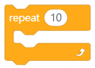
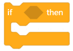
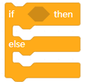
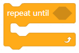

mBot Code Blocks
================

Show
----

.. |07-led-panel-x-clears-screen| image:: _static/images/mbot/00-show/07-led-panel-x-clears-screen.png

.. csv-table:: Show
   :header: Block, Effect

   |00-led-panel-shows-image-for-secs|,
   |01-led-panel-shows-image|,
   |02-led-panel-shows-image-at-x-y|,
   |03-led-panel-shows-text|,
   |04-led-panel-shows-text-at-x-y|,
   |05-led-panel-shows-number-text|,
   |06-led-panel-shows-time|,
   |07-led-panel-x-clears-screen|,

Light and Sound
---------------

.. csv-table:: Light and Sound
   :header: Block, Effect

   |00-led-shows-color-for-secs|,
   |01-led-shows-color|,
   |02-turn-on-light-with-color-red-green-blue|,
   |03-play-note-for-x-beats|,
   |04-play-sound-at-frequency-of-hz-for-secs|,

Action
------

.. |06-stop-moving| image:: _static/images/mbot/02-action/06-stop-moving.png

.. csv-table:: Action
   :header: Block, Effect

   |00-move-forward-at-power-x-for-secs|,
   |01-move-backward-at-power-x-for-secs|,
   |02-turn-left-at-power-x-for-secs|,
   |03-turn-right-at-power-x-for-secs|,
   |04-x-at-power-y|,
   |05-left-wheel-turns-at-power-x-right-wheel-at-power-y|,
   |06-stop-moving|,

Sensing
-------

.. |05-ir-remote-pressed| image:: _static/images/mbot/03-sensing/05-ir-remote-pressed.png

.. csv-table:: Sensing
   :header: Block, Effect

   |00-light-sensor-light-intensity|,
   |01-ultrasonic-sensor-distance|,
   |02-line-follwer-sensor-value|,
   |03-line-follower-sensor-detects-being|,
   |04-when-on-board-button|,
   |05-ir-remote-pressed|,
   |06-send-ir-message-text|,
   |07-ir-message-received|,
   |08-timer|,
   |09-reset-timer|,

Control
-------

.. csv-table:: Control
   :header: Block, Effect

   |00-wait-x-seconds|,
   |01-repeat-x|,
   |02-forever|,
   |03-if-then|,
   |04-if-then-else|,
   |05-wait-until|,
   |06-repeat-until|,
   |07-stop|,

Operators
---------

.. |00-x-plus-y| image:: _static/images/common/01-operators/00-x-plus-y.png

.. |16-| image:: _static/images/common/01-operators/16-.png

.. csv-table:: Operators
   :header: Block, Effect

   |00-x-plus-y|,
   |01-x-minus-y|,
   |02-x-times-y|,
   |03-x-divide-y|,
   |04-pick-random-x-to-y|,
   |05-x-gt-y|,
   |06-x-lt-y|,
   |07-x-equals-y|,
   |08-x-and-y|,
   |09-x-or-y|,
   |10-not-x|,
   |11-join-text-text|,
   |12-letter-x-of-text|,
   |13-length-of-text|,
   |14-text-contains-x|,
   |15-x-mod-y|,
   |16-|,
   |17-math-of-x|,

Variables
---------

.. csv-table:: Variables
   :header: Block, Effect

   |00-make-a-variable|,
   |01-make-a-list|,

My-Blocks
---------

.. |00-make-a-block| image:: _static/images/common/03-my-blocks/00-make-a-block.png

.. csv-table:: My-Blocks
   :header: Block, Effect

   |00-make-a-block|,