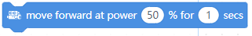

mBot Code Blocks
================

Action
------

.. |move-backward-at-power-x-for-secs| image:: _static/images/mbot/action/move-backward-at-power-x-for-secs.png

.. |stop-moving| image:: _static/images/mbot/action/stop-moving.png
.. |turn-left-at-power-x-for-secs| image:: _static/images/mbot/action/turn-left-at-power-x-for-secs.png
.. |turn-right-at-power-x-for-secs| image:: _static/images/mbot/action/turn-right-at-power-x-for-secs.png
.. |x-at-power-y| image:: _static/images/mbot/action/x-at-power-y.png

.. csv-table:: Action
   :header: Block, Effect

   |left-wheel-turns-at-power-x-right-wheel-at-power-y|, 
   |move-backward-at-power-x-for-secs|, 
   |move-forward-at-power-x-for-secs|, 
   |stop-moving|, 
   |turn-left-at-power-x-for-secs|, 
   |turn-right-at-power-x-for-secs|, 
   |x-at-power-y|, 

Sensing
-------

.. |ir-message-received| image:: _static/images/mbot/sensing/ir-message-received.png

.. |light-sensor-ligh-intensity| image:: _static/images/mbot/sensing/light-sensor-ligh-intensity.png

.. |line-follwer-sensor-value| image:: _static/images/mbot/sensing/line-follwer-sensor-value.png
.. |reset-timer| image:: _static/images/mbot/sensing/reset-timer.png
.. |send-ir-message-text| image:: _static/images/mbot/sensing/send-ir-message-text.png
.. |timer| image:: _static/images/mbot/sensing/timer.png

.. |when-on-board-button| image:: _static/images/mbot/sensing/when-on-board-button.png

.. csv-table:: Sensing
   :header: Block, Effect

   |ir-message-received|, 
   |ir-remote-pressed|, 
   |light-sensor-ligh-intensity|, 
   |line-follower-sensor-detects-being|, 
   |line-follwer-sensor-value|, 
   |reset-timer|, 
   |send-ir-message-text|, 
   |timer|, 
   |ultrasonic-sensor-distance|, 
   |when-on-board-button|, 

Light and Sound
---------------

.. |led-shows-color| image:: _static/images/mbot/lightsound/led-shows-color.png
.. |play-note-fthe Scratch IDELight and Sound
   :header: Block, Effect

   |led-shows-color-for-secs|, 
   |led-shows-color|, 
   |play-note-for-x-beats|, 
   |play-sound-at-frequency-of-hz-for-secs|, 
   |turn-on-light-with-color-red-green-blue|, 

Show
----

.. |led-panel-shows-image-at-x-y| image:: _static/images/mbot/show/led-panel-shows-image-at-x-y.png
.. |led-panel-shows-image-for-sces| image:: _static/images/mbot/show/led-panel-shows-image-for-sces.png
.. |led-panel-shows-image| image:: _static/images/mbot/show/led-panel-shows-image.png
.. |led-panel-shows-number-text| image:: _static/images/mbot/show/led-panel-shows-number-text.png
.. |led-panel-shows-text-at-x-y| image:: _static/images/mbot/show/led-panel-shows-text-at-x-y.png
.. |led-panel-shows-text| image:: _static/images/mbot/show/led-panel-shows-text.png
.. |led-panel-shows-time| image:: _static/images/mbot/show/led-panel-shows-time.png
.. |led-panel-x-clears-screen| image:: _static/images/mbot/show/led-panel-x-clears-screen.png

.. csv-table:: Show
   :header: Block, Effect

   |led-panel-shows-image-at-x-y|, 
   |led-panel-shows-image-for-sces|, 
   |led-panel-shows-image|, 
   |led-panel-shows-number-text|, 
   |led-panel-shows-text-at-x-y|, 
   |led-panel-shows-text|, 
   |led-panel-shows-time|, 
   |led-panel-x-clears-screen|,

Control
-------

.. |if-then-else| image:: _static/images/common/control/if-then-else.png
.. |if-then| image:: _static/images/common/control/if-then.png

.. |repeat-x| image:: _static/images/common/control/repeat-x.png

.. |wait-until| image:: _static/images/common/control/wait-until.png
.. |wait-x-seconds| image:: _static/images/common/control/wait-x-seconds.png

.. csv-table:: Control
   :header: Block, Effect

   |forever|, 
   |if-then-else|, 
   |if-then|, 
   |repeat-until|, 
   |repeat-x|, 
   |stop|, 
   |wait-until|, 
   |wait-x-seconds|, 

Operators
---------

.. |join-text-text| image:: _static/images/common/operators/join-text-text.png
.. |length-of-text| image:: _static/images/common/operators/length-of-text.png
.. |letter-x-to-text| image:: _static/images/common/operators/letter-x-to-text.png
.. |math-of-x| image:: _static/images/common/operators/math-of-x.png

.. |pick-random-x-to-y| image:: _static/images/common/operators/pick-random-x-to-y.png
.. |round-x| image:: _static/images/common/operators/round-x.png
.. |text-contains-x| image:: _static/images/common/operators/text-contains-x.png
.. |x-and-y| image:: _static/images/common/operators/x-and-y.png
.. |x-divide-y| image:: _static/images/common/operators/x-divide-y.png
.. |x-equals-y| image:: _static/images/common/operators/x-equals-y.png
.. |x-gt-y| image:: _static/images/common/operators/x-gt-y.png
.. |x-lt-y| image:: _static/images/common/operators/x-lt-y.png
.. |x-minus-y| image:: _static/images/common/operators/x-minus-y.png
.. |x-mod-y| image:: _static/images/common/operators/x-mod-y.png
.. |x-or-y| image:: _static/images/common/operators/x-or-y.png
.. |x-plus-y| image:: _static/images/common/operators/x-plus-y.png
.. |x-times-y| image:: _static/images/common/operators/x-times-y.png

.. csv-table:: Operators
   :header: Block, Effect

   |join-text-text|, 
   |length-of-text|, 
   |letter-x-to-text|, 
   |math-of-x|, 
   |not-x|, 
   |pick-random-x-to-y|, 
   |round-x|, 
   |text-contains-x|, 
   |x-and-y|, 
   |x-divide-y|, 
   |x-equals-y|, 
   |x-gt-y|, 
   |x-lt-y|, 
   |x-minus-y|, 
   |x-mod-y|, 
   |x-or-y|, 
   |x-plus-y|, 
   |x-times-y|,

Variables
---------

.. |make-a-variable| image:: _static/images/common/variables/make-a-variable.png

.. csv-table:: Variables
   :header: Block, Effect

   |make-a-list|, 
   |make-a-variable|, 

My-Blocks
---------

.. |make-a-block| image:: _static/images/common/my-blocks/make-a-block.png

.. csv-table:: My-Blocks
   :header: Block, Effect

   |make-a-block|, 