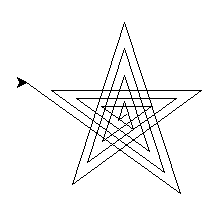
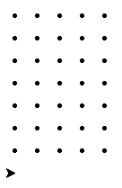

Turtle
======

``Turtle`` is part of the Python API used to draw graphics on the screen. The main objects in Turtle are the ``Screen`` and ``Pen``. The Screen is the canvas that is being drawn onto and the Pen is the object that you use to draw. As always, the best way to learn Turtle is to see some examples and start coding your own creations. 

Draw a line
-----------

Here's a simple program to draw a square.

.. literalinclude:: code/oneoffcoder/turtle/line.py
   :language: python
   :linenos:

.. figure:: _static/images/turtle/line.png

    Line output.

Draw a square
-------------

Here's a simple program to draw a square.

.. literalinclude:: code/oneoffcoder/turtle/square.py
   :language: python
   :linenos:

.. figure:: _static/images/turtle/square.png

    Square output.

Draw stars
----------

Here's code to draw a star.

.. literalinclude:: code/oneoffcoder/turtle/star.py
   :language: python
   :linenos:
   :emphasize-lines: 8-10

    Star output.

Let's draw a fancy star.

.. literalinclude:: code/oneoffcoder/turtle/fancy-star.py
   :language: python
   :linenos:
   :emphasize-lines: 8-10

    Star output.

Draw rectangular spirals
------------------------

Let's draw a rectangular spiral from the inside out. We will change the color that the turtle will use to red. We will also define the ``spiral`` function to draw each spiral.

.. literalinclude:: code/oneoffcoder/turtle/inside-out.py
   :language: python
   :linenos:
   :emphasize-lines: 3-7, 13-14

    Inside-out rectangular spiral output.

Let's draw a rectangular spiral from the outside-in. Since we are drawing the spirals from the outside-in, we will reverse the sizes.

.. literalinclude:: code/oneoffcoder/turtle/outside-in.py
   :language: python
   :linenos:
   :emphasize-lines: 14-16

    Outside-in rectangular spiral output.

Draw polygons
-------------

How about polygons? Let's draw a hexagon.

.. literalinclude:: code/oneoffcoder/turtle/hexagon.py
   :language: python
   :linenos:
   :emphasize-lines: 8-10, 12-14

    Hexagon output.

Draw a spiral helix
-------------------

Let's draw a spiral helix. First, let's change the background color to black. Second, let's define the colors that we want the pen to use. Lastly, since there's a lot to draw, let's set the speed of the pen to 100.

.. literalinclude:: code/oneoffcoder/turtle/spiral-helix.py
   :language: python
   :linenos:
   :emphasize-lines: 5, 7, 10

    Spiral helix output.

Dots
----

Here's an exercise in drawing dots. We use ``penup`` to make sure no drawing is done when moving and ``dot`` to place the pen down to create the dots. Additionally, if you want the change the shape of the pen from a classic arrow, you may use the ``shape`` method. Below, for each row of dot we are drawing, we change the shape.

.. literalinclude:: code/oneoffcoder/turtle/dots.py
   :language: python
   :linenos:
   :emphasize-lines: 9, 11, 14-15, 18

    Dots output.

We may also ``stamp`` out colorful patterns.

.. literalinclude:: code/oneoffcoder/turtle/stamp.py
   :language: python
   :linenos:
   :emphasize-lines: 10, 16, 19-20, 23

    Stamp output.

Crazy lines
-----------

Let's draw some crazy lines. We use ``penup`` and ``pendown`` to control when we want the pen to draw onto the canvas. Note that as we iterate through the angles, we speed up the pen's drawing speed as well as change its colors.

.. literalinclude:: code/oneoffcoder/turtle/crazy-lines.py
   :language: python
   :linenos:
   :emphasize-lines: 9, 21, 23, 27

    Crazy lines output.

Bright sun
----------

Here's a sun. Notice how we change the import statement from ``import turtle`` to ``from turtle import *``? Now we have access to the ``begin_fill`` and ``end_fill`` methods, which fills up the shape we draw where we mark begin and end.

.. literalinclude:: code/oneoffcoder/turtle/sun.py
   :language: python
   :linenos:
   :emphasize-lines: 1, 6, 14

    Sun output.

Events
------
We may also interact with the turtle through listening for events. In this example, we listen for key events using the screen's ``onkey`` function and call ``listen`` after we have defined all the keys we are listening to. When a user presses

* the up arrow, we move up
* the down arrow, we move down
* the left arrow, we move left
* the right arrow, we move right
* the ``p`` key, we toggle the pen up and down state
* the ``q`` key, we quit the program

We use the pen's ``setheading`` to orient the cursor as appropriate (to the north, south, east or west) before we move.

.. literalinclude:: code/oneoffcoder/turtle/event.py
   :language: python
   :linenos:
   :emphasize-lines: 4, 10, 17, 23, 29-34, 38, 46-51, 53

    Event output.