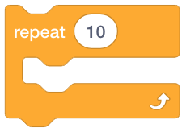
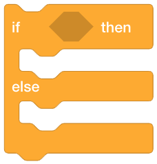
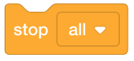
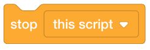
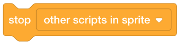

Control
=======

Control code blocks are responsibile for directing the flow of your code and program.

Waiting
-------

You may force your program to wait.

    This code block forces your program to wait for a specified amount of seconds.

    This code block forces your program to wait until a ``termination`` condition is satisified.

.. raw:: html

    <iframe width="560" height="315" src="https://www.youtube.com/embed/NQSy3OCATug" frameborder="0" allowfullscreen></iframe>

:download:`Code <_static/code/scratch-6.1-control-waiting.sb3>`

Loops
-----

To make your program repeat something over and over, use the following loops.

    This code block repeats code for the specified amount of time.

    This code block repeats code forever.

.. figure:: _static/images/control/06-repeat-until.png

    This code block repeats code until a ``termination`` condition is satisified.

.. raw:: html

    <iframe width="560" height="315" src="https://www.youtube.com/embed/yf87rzE922Y" frameborder="0" allowfullscreen></iframe>

:download:`Code <_static/code/scratch-6.2-control-loops.sb3>`

Conditionals
------------

Conditionals are responsible for decisions.

    This code block executes code only if the specified condition is satisfied.

    This code block executes one of two code blocks.

.. raw:: html

    <iframe width="560" height="315" src="https://www.youtube.com/embed/OXng0uzeKtc" frameborder="0" allowfullscreen></iframe>

:download:`Code <_static/code/scratch-6.3-control-conditionals.sb3>`

Stopping
--------

You may stop your program using the following code blocks.

    This code block stops all code.

    This code block stops the specified script.

    This code block stops other scripts.

Clones
------

You may also listen for clone events. Cloning is the act of copying and creating a new object from another.

    This code block listens for when an object starts as a clone.

    This code block creates a clone.

    This code block deletes a clone.