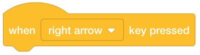
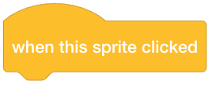
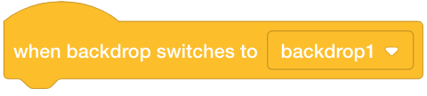
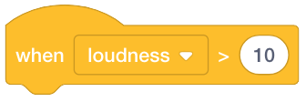
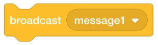
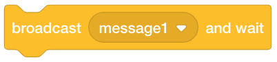

Events
======

Event code blocks enable you to listen for events and react as appropriate.

When start is clicked (green flag)
----------------------------------

.. figure:: _static/images/events/00-when-green-flag-clicked.png

    This code block listens for when ``start`` is clicked.

When a key is clicked
---------------------

You may listen for almost any key being clicked.

    This code block listens for when the ``space bar`` is clicked.

    This code block listens for when the ``up arrow`` is clicked.

    This code block listens for when the ``down arrow`` is clicked.

    This code block listens for when the ``right arrow`` is clicked.

    This code block listens for when the ``left arrow`` is clicked.

When sprite is clicked
----------------------

    This code block listens for when a sprite is clicked.

When backdrop switches
----------------------

    This code block listens for when a backdrop switches.

When loudness exceeds
---------------------

    This code block listens for when the volume exceeds a threshold.

When timer exceeds
------------------

    This code block listens for when the timer exceeds a threshold.

When message received
---------------------

    This code block listens for when a message is received.

Broadcasting messages
---------------------

    This code block broadcasts a message.

    This code block broadcasts a message and waits.