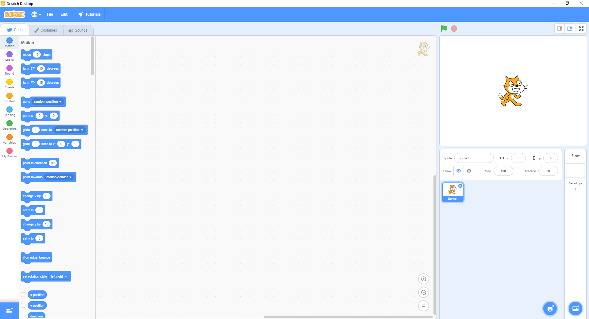
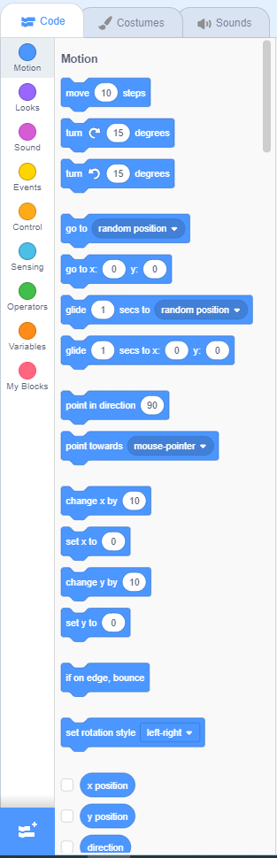
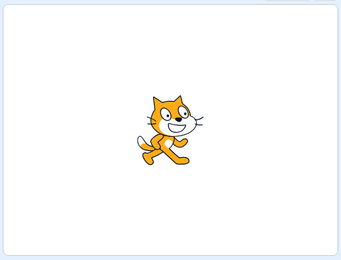
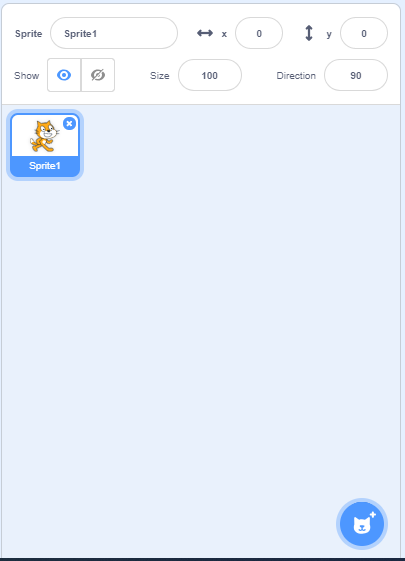

Integrated Development Environment
==================================

.. raw:: html

    <iframe width="560" height="315" src="https://www.youtube.com/embed/Y-2sjHnRg3s" frameborder="0" allowfullscreen></iframe>

The ``Scratch`` Integrated Development Environment (IDE) is a complete, self-contained program used to code games, control drones and program behavior into robots. Out of the box, Scratch is typically used to teach students how to code games. However, do not underestimate Scratch, as it is a versatile IDE that many others build upon to code and program other things. When you start Scratch, the IDE should look like the following. Note that there are 7 major components to the IDE.

.. csv-table:: Scratch IDE Components
   :header: Component, Purpose

   Menu, Load and save files.
   Code Blocks, Reusable code blocks to control and add behavior to your program.
   Script Editor, Area to build your code logic.
   Stage, Area that shows your program in execution.
   Program Control, Controls to start and stop your program.
   Sprite Control, "Area to add, update, remove and define your sprites."
   Backdrop Control, "Area to add, update, remove and dfine backgrounds."

We breakdown these major components of the Scratch IDE and discuss each below.

    
    The Scratch Integrated Development Environment (IDE).

Menu 
----

The menu is where you may choose to 

- change the language of the IDE (click on the globe icon),
- save or load Scratch programs (click on the ``File`` menu), or
- edit the behavior of the IDE (click on the ``Edit`` menu).

    Scratch has ``File`` and ``Edit`` menus.

Code blocks
-----------

In Scratch, code is organized visually into types known as ``code blocks``. There are 9 types of code blocks. Here, we only show where the code block is located in the IDE; later, we will go into depth about each of the different types of code blocks.

.. csv-table:: Code Block Types
   :header: Type, Color, Purpose

   Motion, Blue, Move things.
   Looks, Purple, Change the look of things.
   Sound, Magenta, Manipulate sounds.
   Events, Yellow, Listen for events.
   Control, Orange, Control your program.
   Sensing, Light Blue, Sense the surrounding.
   Operators, Green, Math and comparison operations.
   Variables, Dark Orange, Create and retrieve variables.
   My Blocks, Red, Create custom blocks.

    ``Code blocks`` are organized into types by color.

Script editor
-------------

The script editor area is where you drag and drop code blocks into to create your programs. When you start up Scratch, the script editor will be empty (or blank). Do not let this empty space fool you, as when you start to master Scratch, you will quickly have this area filled with code.

    The ``script editor area`` is where you place your code blocks.

Stage
-----

The stage area is where you may observe your code in action as well as the associated sprites, sounds and backdrops. Note that the stage has a ``x-y coordinate`` system in place where ``(0, 0)`` is the center. The domain of the ``x-axis`` is ``[-240, 240]`` and for the ``y-axis`` is ``[-180, 180]``.

    The ``stage`` area displays the ``sprites`` and ``backdrops`` in your program.

Program Controls
----------------

There are two buttons that you may use to start and stop your program.

- ``green flag`` is used start your program
- ``red octagon`` is used to stop your program

    The ``controls`` are what you may press to start (green flag) and stop (red octagon) your program.

Sprite Control
--------------

The sprite control area is where you may add, remove and update your sprites. When you highlight a particular sprite in this area, note that the current state of the sprite is also shown (such as the x and y position).

    The ``sprite control`` area allows you to add, remove and update your sprites.

Backdrop Control
----------------

The backdrop control area is where you may add, remove and update your backdrops.

    The ``backdrop control`` area allows you to add, remove and update your backdrops.