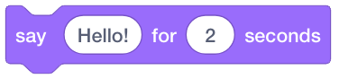
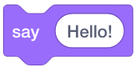
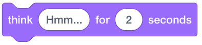
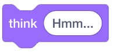
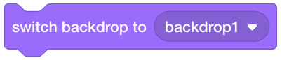
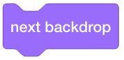
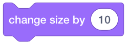
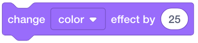
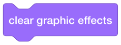
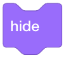

Looks
=====

Look code blocks change the way your sprites look.

Saying something
----------------

    This code block makes a sprite say something lasting for the specified time.

    This code block makes a sprite say something.

.. raw:: html

    <iframe width="560" height="315" src="https://www.youtube.com/embed/iugsjaJ1OgU" frameborder="0" allowfullscreen></iframe>

Thinking something
------------------

    This code block makes a sprite think something lasting for the specified time.

    This code block makes a sprite think something.

.. raw:: html

    <iframe width="560" height="315" src="https://www.youtube.com/embed/KPI6RGQsL7k" frameborder="0" allowfullscreen></iframe>

Changing costume
----------------

    This code block changes the costume of a sprite to a specific one.

    This code block changes the costume of a sprite to the ``next`` one.

Changing backdrop
-----------------

    This code block changes the backdrop to a specific one.

    This code block changes the backdrop to the ``next`` one.

Changing size
-------------

    This code block changes the size of a sprite by ``magnitude``.

    This code block changes the size of a sprite by ``percentage``.

Changing color
--------------

    This code block changes the color effect.

    This code block sets the color effect to a specific value.

    This code block clears the graphic effects.

Showing and hiding
------------------

    This code block shows a sprite.

    This code block hides a sprite.

Layers
------

The stage has ``layers``. Layers that are in the front blocks those that are in the back. The following code block changes the layers of a sprite.

    This code block changes which layer, ``front`` or ``back``, a sprite will be placed in.

.. figure:: _static/images/looks/17-go-foward-1-layers.png

    This code block sends a sprite ``forward`` or ``backward`` into the layers.