Motion
======

Motion code blocks are responsible for making your sprites move.

Basic moving
------------

    This code block moves a sprite left and right.

.. raw:: html

    <iframe width="560" height="315" src="https://www.youtube.com/embed/gEwEVw49uBM" frameborder="0" allowfullscreen></iframe>

Basic Rotation
--------------

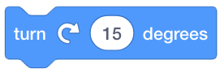

    This code block rotates a sprite to the right by 15 degrees.

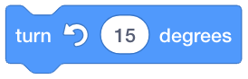

    This code block rotates a sprite to the left by 15 degrees.

.. raw:: html

    <iframe width="560" height="315" src="https://www.youtube.com/embed/v9lddVBCC3s" frameborder="0" allowfullscreen></iframe>

Moving to a random position
---------------------------

    This code block moves a sprite to a random ``x-y`` position.

.. raw:: html

    <iframe width="560" height="315" src="https://www.youtube.com/embed/eGVKFCaMN4g" frameborder="0" allowfullscreen></iframe>

Moving to the mouse pointer
---------------------------

    This code block moves a sprite to wherever the mouse cursor is on the stage.

.. raw:: html

    <iframe width="560" height="315" src="https://www.youtube.com/embed/FU6Kh83GwZs" frameborder="0" allowfullscreen></iframe>

Moving to a specific x and y coordinate
---------------------------------------

    This code block moves a sprite to a specific ``x-y`` location.

.. raw:: html

    <iframe width="560" height="315" src="https://www.youtube.com/embed/SWy3GOzM6RE" frameborder="0" allowfullscreen></iframe>

Gliding
-------

``Gliding`` is different from ``moving``. When you ``move`` a sprite, it disappears and then reappears where you want it to be. When you ``glide`` a sprite, a smooth transition is created from where the sprite currently is located to where you want it to be; there is ``animation`` involved.

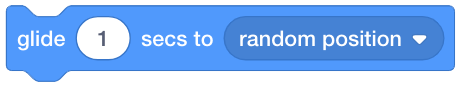

    This code block glides a sprite to a random position.

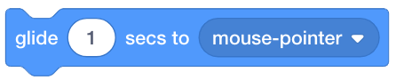

    This code block glides a sprite to wherever the mouse cursor is on the stage.

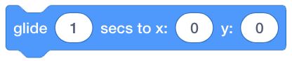

    This code block glides a sprite to a specific ``x-y`` location.

.. raw:: html

    <iframe width="560" height="315" src="https://www.youtube.com/embed/MWKrZKRx1tc" frameborder="0" allowfullscreen></iframe>

Pointing
--------

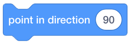

    This code block points a sprite to specified direction (in angles).

    This code block points a sprite towards the mouse cursor.

.. raw:: html

    <iframe width="560" height="315" src="https://www.youtube.com/embed/Skjjguw4ChQ" frameborder="0" allowfullscreen></iframe>

Changing x
----------

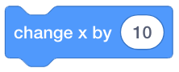

    This code block adds the specified value to the current ``x`` position value.

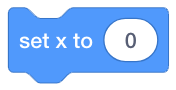

    This code block sets the ``x`` position value to a specific value.

.. raw:: html

    <iframe width="560" height="315" src="https://www.youtube.com/embed/94lOfqh9hDQ" frameborder="0" allowfullscreen></iframe>

Changing y
----------

    This code block  adds the specified value to the current ``y`` position value.

    This code block sets the ``y`` position to a specific value.

.. raw:: html

    <iframe width="560" height="315" src="https://www.youtube.com/embed/bsKYCRyUEHI" frameborder="0" allowfullscreen></iframe>

Bouncing
--------

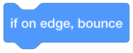

    This code block bounces a sprite if it is on the edge of the stage.

.. raw:: html

    <iframe width="560" height="315" src="https://www.youtube.com/embed/QzxlpHvVEr8" frameborder="0" allowfullscreen></iframe>

Rotation styles
---------------

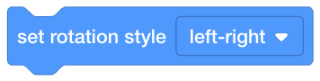

    This code block sets the rotation style to ``left-right``.

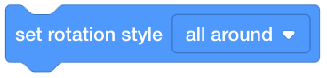

    This code block sets the rotation style to ``all around``.

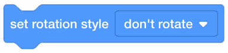

    This code block sets the rotation style to ``don't rotate``.
