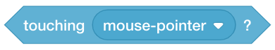
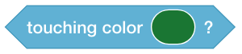
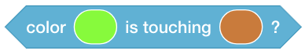
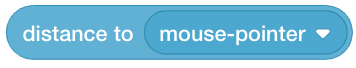
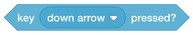
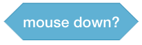
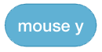

Sensing
=======

Sensing code blocks allow your program, sprites and objects to sense the stage.

Touching
--------

    This code block detects when something is touching the mouse pointer.

    This code block detects when something is touching a specified color.

    This code block detects when two specified colors are touching.

Distance
--------

    This code block detects the distance to the specified object (for example, ``mouse pointer``).

Asking
------

You may get input from users.

    This code block asks the user for input.

Keys
----

.. figure:: _static/images/sensing/05-key-space-pressed.png

    This code block senses when the ``space bar`` is pressed.

    This code block senses when the ``up arrow`` is pressed.

    This code block senses when the ``down arrow`` is pressed.

    This code block senses when the ``right arrow`` is pressed.

    This code block senses when the ``left arrow`` is pressed.

Mouse
-----

    This code block senses if the mouse is pressed down.

.. figure:: _static/images/sensing/11-mouse-x.png

    This code block senses the ``x`` coordinate of the mouse.

    This code block senses the ``y`` coordinate of the mouse.

Drag
----

    This code block sets the drag mode.

Timer
-----

    This code block resets the timer.

Stage
-----

    This code block senses the backdrop of the stage. For example, is it the first, second, third, and so on backdrop?

    This code block senses the backdrop name of the stage.

    This code block senses the volume of the stage.

    This code block senses the specified variable of the stage.

Days
----

.. figure:: _static/images/sensing/18-days-since-2000.png

    This code block senses the number of days since the year ``2000``.