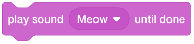
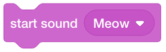
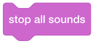
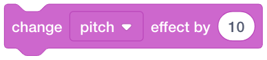
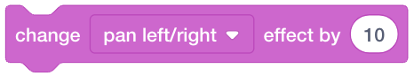
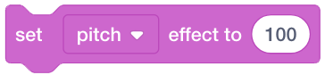
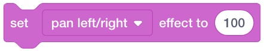
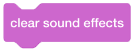
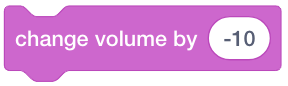
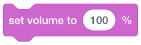

Sound
=====

Sound code blocks controls sounds.

Playing sound
-------------

    This code block plays a sound and blocks all code following it until the sound is finished playing.

    This code block plays a sound and is not blocking.

    This code block stops all sounds.

Changing pitch and pan effects
------------------------------

    This code block changes the ``pitch`` effect by an amount.

    This code block changes the ``pan left-right`` effect by an amount.

    This code block sets the ``pitch`` effect.

    This code block sets the ``pan left-right`` effect.

    This code block clears the sound effects.

Changing volume
---------------

    This code block changes the volume by an amount.

    This code block changes the volume by a percentage.