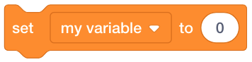

Variables
=========

Variables are like ``boxes`` that can hold things. In Scratch, a variable has a name and can hold a value. Variables are useful for tracking things such as the location of a sprite.

Mutating variables
------------------

The following code blocks changes (``mutates``) a variable.

    This code block sets a variable to a specified value.

    This code block changes a variable by the specified amount.

Showing and hiding variables
----------------------------

You may also show and hide variables on the stage.

    This code block shows a variable.

    This code block hides a variable.