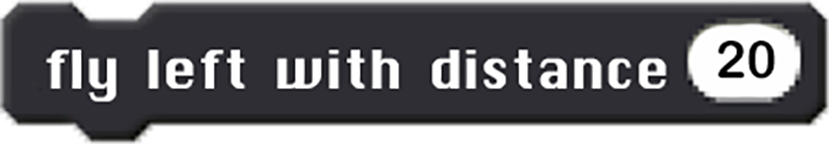

Code Blocks
===========

There are 12 Tello code blocks that you may used. They are described below.

Take off and landing
--------------------

    Instructs the drone to take off (lift up vertically).

    Instructs the drone to land (come down vertically).

Flying up and down
------------------

    Instructs the drone to fly up.

    Instructs the drone to fly down.

Flying left and right
---------------------

    Instructs the drone to fly left.

    Instructs the drone to fly right.

Flying forward and backward
---------------------------

    Instructs the drone to fly forward.

    Instructs the drone to fly backward.

Rotating
--------

    Instructs the drone to rotate clockwise.

    Instructs the drone to rotate counter-clockwise.

Miscellaneous
-------------

    Instructs the drone to flip.

    Sets the speed of the drone motors.