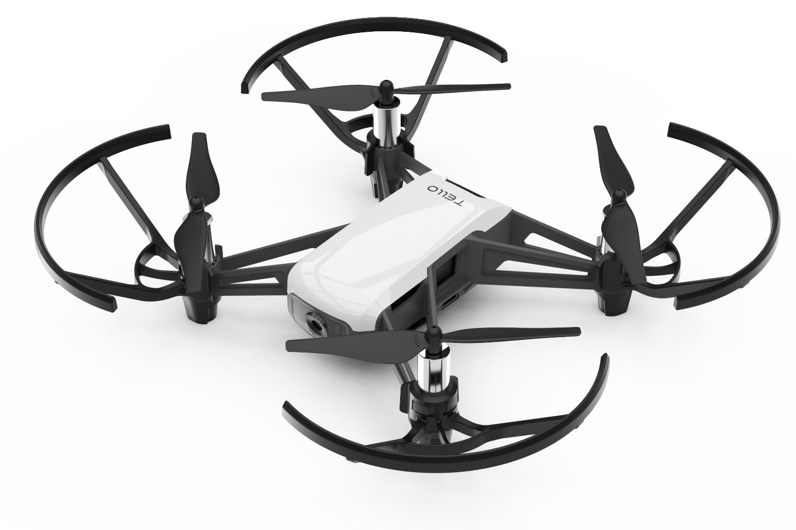
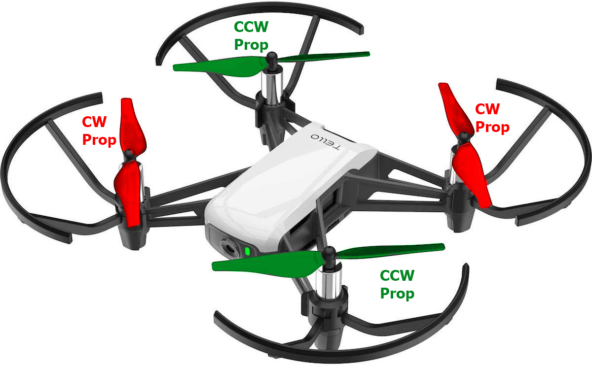
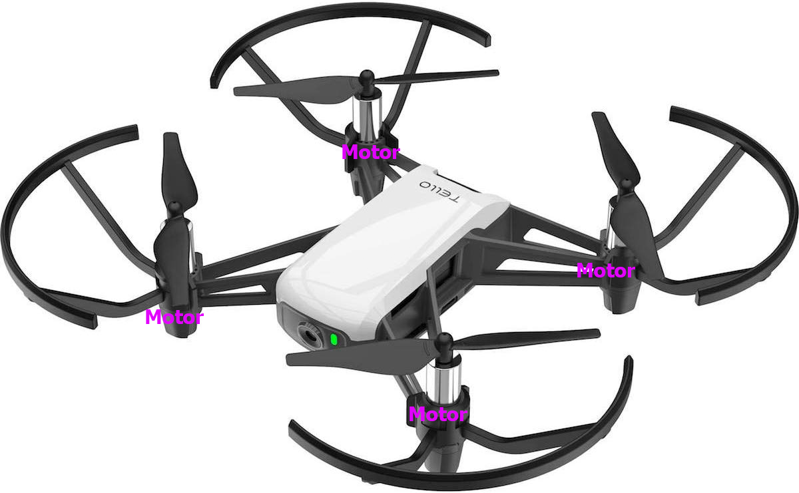
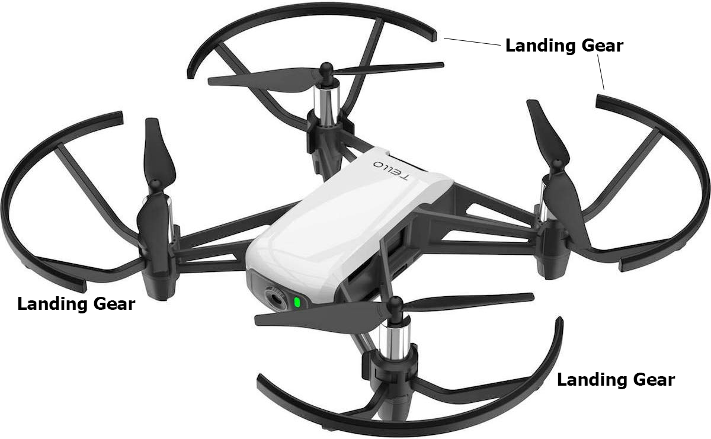
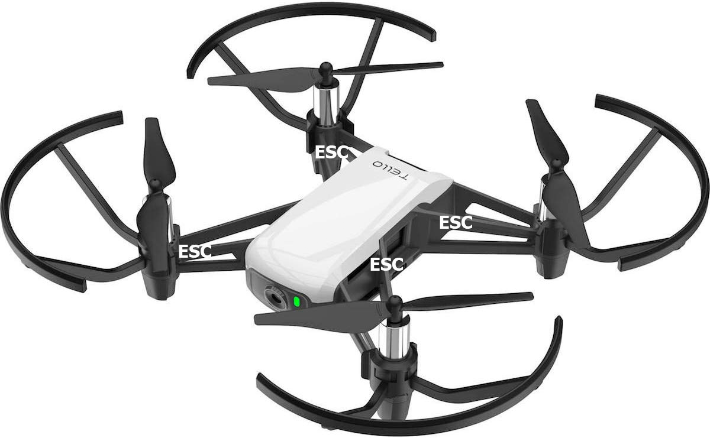
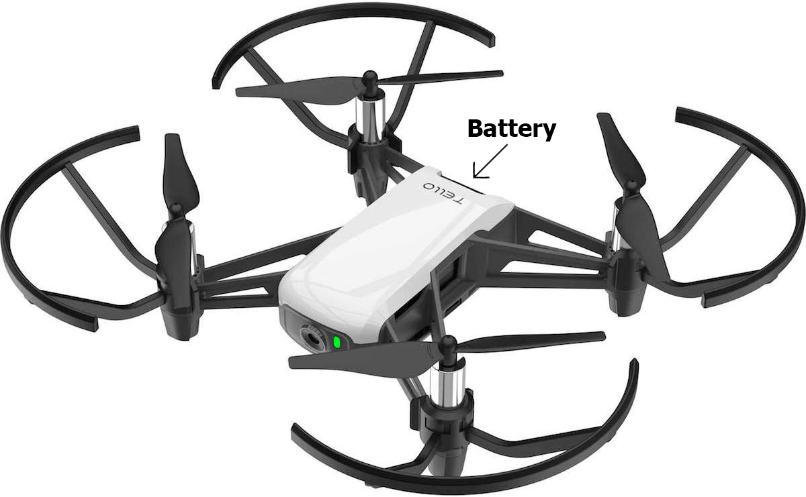
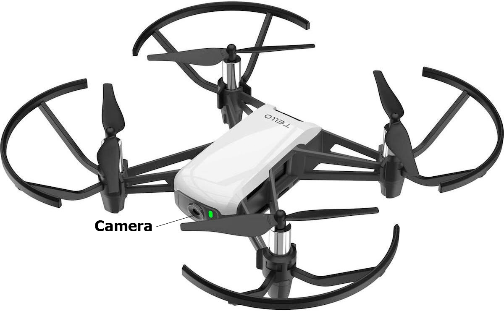

Drone Parts
===========

Props
-----

The ``propellers`` or ``props`` are used to create roll, pitch and yaw. Note that there are 2 types of props, clockwise ``CW`` and counter-clockwise ``CCW``. The CCW props have ``notches`` while the CW props do not. On every Tello, you should have 2 CW and 2 CCW props, and they should be placed diagonal from each other. With the Tello laying down and the battery facing towards your body and the camera facing away, the top-left and bottom-right props should be CCW props, and the top-right and bottom-left props should be CW props. 

Motor
-----

The motors are responsible for moving the props.

Landing gears
-------------

Landing gears help the drone land safely.

Body
----

The body holds the main control board and communicates signals.

Electronic speed controller
---------------------------

The electronic speed controllers, ``ESCs``, are responsible for modulating signals to the motors from the main control board.

Receiver
--------

There is a receiver that listens in for incoming signals.

Antenna
-------

The antenna captures remote signals. 

Battery
-------

The battery powers the drone. The specification of the Tello battery is as follows.

* Lithium Ion (Battery Type)
* 4.35 V (Max Charge Voltage)
* 3.8 V (Nominal Voltage)
* 1100 mAh, 4.18 Wh (Rated Capacity)

Camera
------

The camera is used to capture images or videos.

Sensors
-------

Some drones may have additional sensors (light, GPS, ultrasound, etc.). The Tello does not have such additional sensors, apart from the camera.