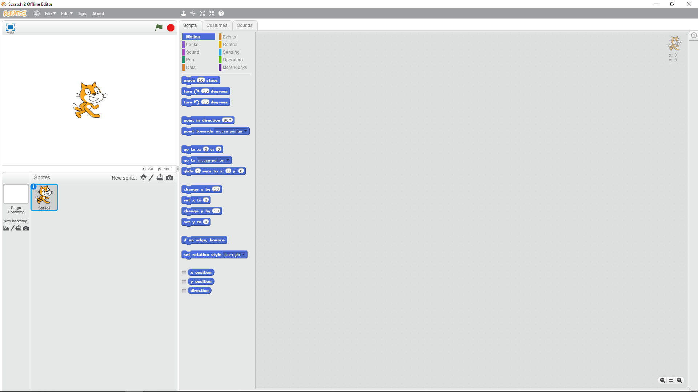
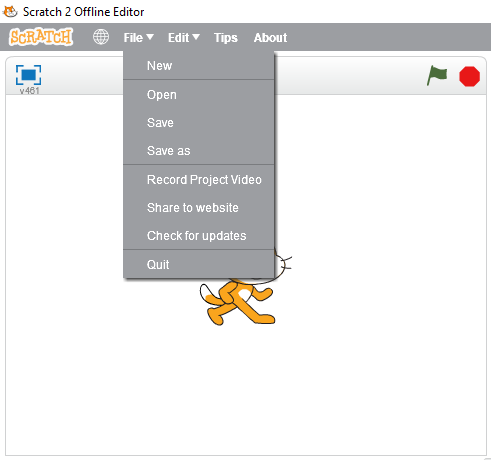
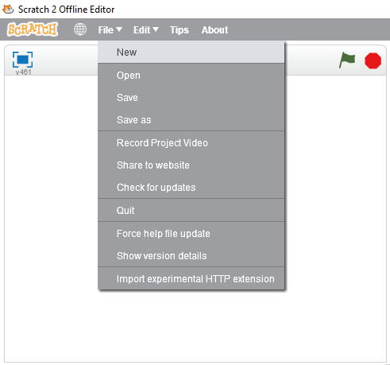
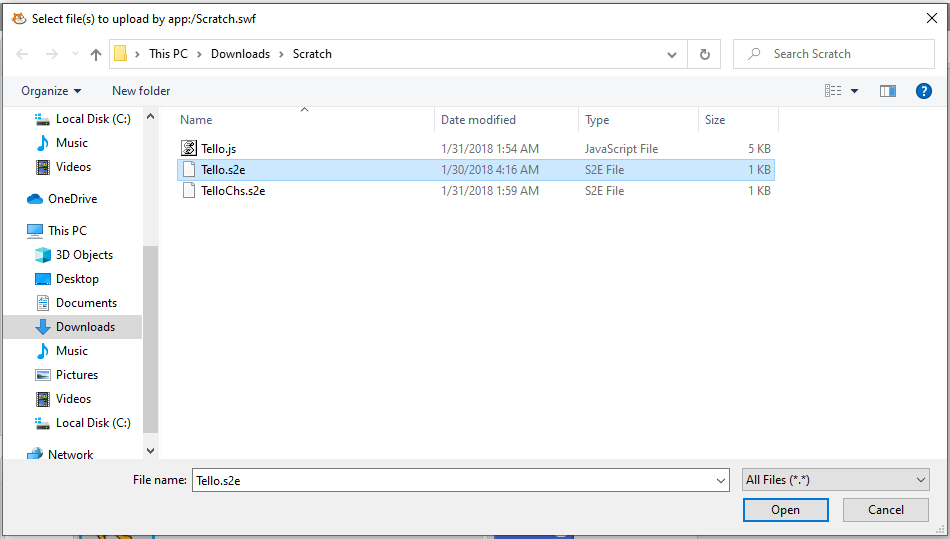
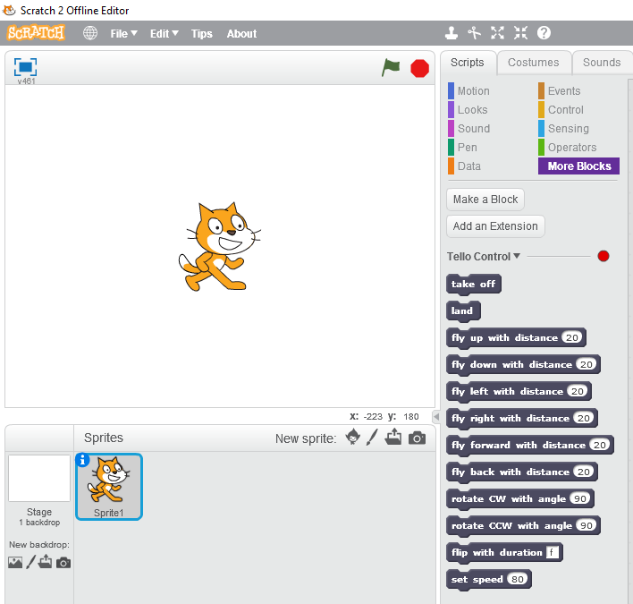
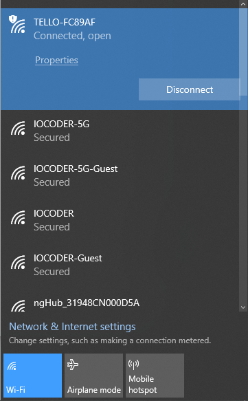
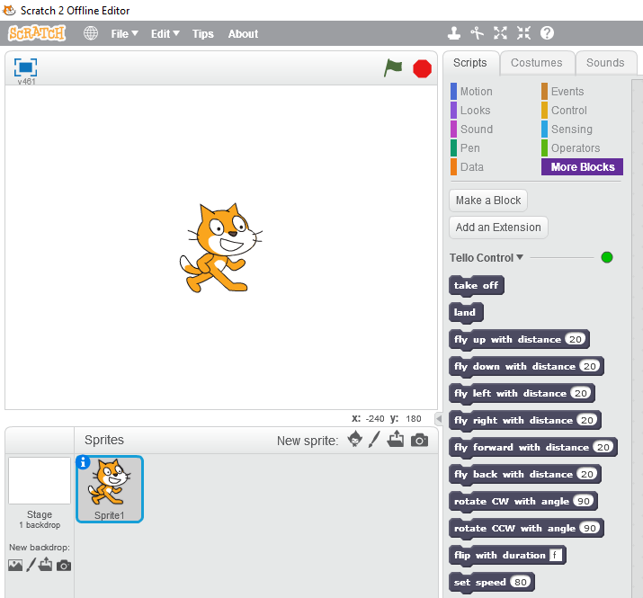

Prerequisites
=============

To program the Tello drone, you will need a few key pieces of software.

* `Adobe Air <https://get.adobe.com/air/>`_
* `Scratch <https://scratch.mit.edu/scratchr2/static/sa/Scratch-461.exe>`_
* `NodeJS <https://nodejs.org/en/>`_
* `Tello Extension <https://dl-cdn.ryzerobotics.com/downloads/tello/20180222/Scratch.zip>`_

You will need to install these software in the order given above. Note the following.

* ``Adobe Air`` is required by ``Scratch`` to work.
* The offline version of ``Scratch 2.0`` is required (the latest is ``Scratch 3.0``). Scratch is the ``Integrated Development Environment`` (IDE) that you will use to program behavior and fligt paths into the Tello drone.
* ``NodeJS`` version 12 or higher should work. ``NodeJS`` may be looked as simply a ``JavaScript`` runtime.
* The ``Tello Extension`` contains files that has a ``plugin`` for Scratch and a NodeJS ``script`` that enables your program/Scratch to connect to the drone. The ``Tello Extension`` is wrapped in a file called ``Scratch.zip`` that you must unzip. Please make note of where you downloaded and unzipped ``Scratch.zip`` as you will need to access the contents later.

After you have successfully installed the software above, you will need to load up Scratch and start the NodeJS program to connect to the Tello drone.

Scratch
-------

After you start the Scratch IDE, you should see the application as follows.

    The Scratch version 2.0 Offline IDE.

The next thing to do is to import the ``Tello Scratch Extension``, which is a file named ``Tello.s2e``. What you will need to do is to hold the ``Shift`` key and use your mouse to click on the ``File`` menu. If you do not hold the ``Shift`` key, you will not see the menu item ``Import experimental HTTP extension``. Instead, you will only see the normal menu subitems as follows.

    Selecting the ``File`` menu without holding the ``Shift`` key.

If you press and hold the ``Shift`` key and then use the mouse to select the ``File`` menu, you will see the following.

    Selecting the ``File`` menu while holding the ``Shift`` key. Move your mouse and click on ``Import experimental HTTP extension``.

Now, navigate to where you downloaded and unzipped the Tello Extension zip file and select ``Tello.s2e``.

    Selecting the ``Tello.s2e`` extension.

In the ``Code Block`` area, under the ``Scripts`` tab, click on ``More Blocks``. You should see the following.

    The code blocks for Tello programming via Scratch. Note the ``red`` dot indicates that the Scratch IDE is not connected to a Tello drone.

NodeJS
------

To connect to the Tello drone, you will need to run the ``Tello.js`` program as follows. Note that you will first need to change directory, ``cd``, to where you unzipped ``Scratch.zip``.

.. code:: bash

    node Tello.js

Your output on the console should look like the following.

.. code:: bash

    ---------------------------------------
    Tello Scratch Ext running at http://127.0.0.1:8001/
    ---------------------------------------

You will then need to connect your computer to the Tello drone's WiFi.

    Connect to the Tello drone's WiFi.

After you connect to the Tello drone's WiFi, look at the Scratch IDE. You will notice that the ``red`` dot is now ``green`` indicating that the Scratch IDE is connected to the Tello drone.

    The Scratch IDE is now connected to a Tello drone.

After a certain time period of inactivity, where you are not sending commands to the Tello drone from Scratch anymore, the WiFi connection will disconnect and you will have to repeat the WiFi connection steps.
