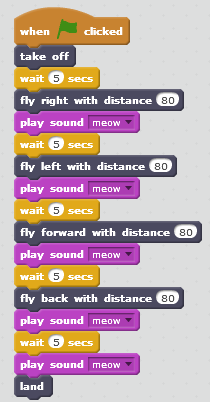
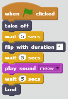
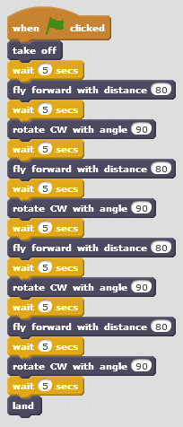
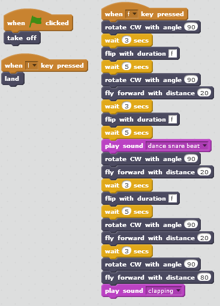
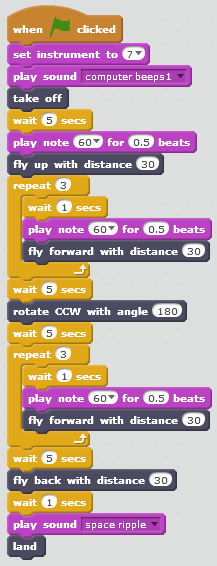

Scratch Programming
===================

Here are some very basic programs you may try for yourself to start drone programming with Scratch and the Tello!

Hello, World!
-------------

Every programming attempt needs a ``Hello, world!`` example. This program simply lifts up the drone and tells it to land again.

.. image:: _static/images/programs/hello-world.png

:download:`Code <_static/code/scratch/hello-world.sb2>`

.. raw:: html

    <iframe width="560" height="315" src="https://www.youtube.com/embed/PlOzEv-rfCY" frameborder="0" allowfullscreen></iframe>

Going up and down
-----------------

This program sends the drone up and then down.

.. image:: _static/images/programs/up-down.png

:download:`Code <_static/code/scratch/up-down.sb2>`

.. raw:: html

    <iframe width="560" height="315" src="https://www.youtube.com/embed/l2jqhyWIozM" frameborder="0" allowfullscreen></iframe>

Left or right?
--------------

This program makes the drone fly left then right.

.. image:: _static/images/programs/left-right.png

:download:`Code <_static/code/scratch/left-right.sb2>`

.. raw:: html

    <iframe width="560" height="315" src="https://www.youtube.com/embed/MOZ-X9hpHBI" frameborder="0" allowfullscreen></iframe>

Forward, then backward
----------------------

This program flies the drone forward then backward.

.. image:: _static/images/programs/forward-back.png

:download:`Code <_static/code/scratch/forward-back.sb2>`

.. raw:: html

    <iframe width="560" height="315" src="https://www.youtube.com/embed/pmmpLN3VvO0" frameborder="0" allowfullscreen></iframe>

Turning around and around
-------------------------

How about rotating the drone clocwise ``cw`` then counter-clockwise ``ccw``?

.. image:: _static/images/programs/cw-ccw.png

:download:`Code <_static/code/scratch/cw-ccw.sb2>`

.. raw:: html

    <iframe width="560" height="315" src="https://www.youtube.com/embed/V7vU6RjtP_g" frameborder="0" allowfullscreen></iframe>

Simple flight
-------------

Simple flying.

:download:`Code <_static/code/scratch/simple-flight.sb2>`

.. raw:: html

    <iframe width="560" height="315" src="https://www.youtube.com/embed/N6LbN22ZCUc" frameborder="0" allowfullscreen></iframe>

Flip meow
---------

Flip and meow!

:download:`Code <_static/code/scratch/flip-meow.sb2>`

.. raw:: html

    <iframe width="560" height="315" src="https://www.youtube.com/embed/Uq6RaLw92ws" frameborder="0" allowfullscreen></iframe>

Flipping out
------------

Can we make the drone flip out?

.. image:: _static/images/programs/flip-with-duration.png

:download:`Code <_static/code/scratch/flip-with-duration.sb2>`

.. raw:: html

    <iframe width="560" height="315" src="https://www.youtube.com/embed/L9cCSMpGv5M" frameborder="0" allowfullscreen></iframe>

Manual control
--------------

Can we manually control the drone? ``YES, WE CAN!``. Note the following.

- ``up arrow`` flies forward
- ``down arrow`` flies backward
- ``left arrow`` flies left
- ``right arrow`` flies right
- ``q`` makes the drone take off
- ``w`` lands the drone
- ``a`` rotates the drone clockwise by 45 degrees
- ``s`` rotates the drone counter-clockwise by 45 degrees

.. image:: _static/images/programs/manual-control.png

:download:`Code <_static/code/scratch/manual-control.sb2>`

.. raw:: html

    <iframe width="560" height="315" src="https://www.youtube.com/embed/nuHRQwba9Dc" frameborder="0" allowfullscreen></iframe>

Spicy manual control
--------------------

Let's spice it up with manual controls! Sounds + motion with the cat!

.. image:: _static/images/programs/manual-control-spicy.png

:download:`Code <_static/code/scratch/manual-control-spicy.sb2>`

.. raw:: html

    <iframe width="560" height="315" src="https://www.youtube.com/embed/5oI9iLC0yz8" frameborder="0" allowfullscreen></iframe>

Square
------

Too square!

:download:`Code <_static/code/scratch/square-flight.sb2>`

.. raw:: html

    <iframe width="560" height="315" src="https://www.youtube.com/embed/9lQxCn5fjW0" frameborder="0" allowfullscreen></iframe>

Square flips
------------

A square with flips!

:download:`Code <_static/code/scratch/square-and-flips.sb2>`

.. raw:: html

    <iframe width="560" height="315" src="https://www.youtube.com/embed/QE05fXLR1eE" frameborder="0" allowfullscreen></iframe>

Spaceship
---------

A UFO spaceship?

:download:`Code <_static/code/scratch/spaceship.sb2>`

.. raw:: html

    <iframe width="560" height="315" src="https://www.youtube.com/embed/RBflUsMkqGg" frameborder="0" allowfullscreen></iframe>